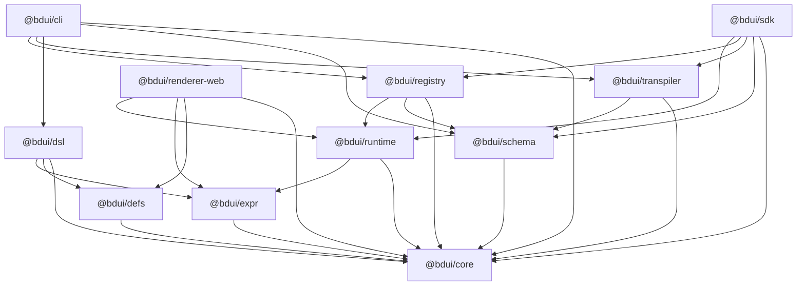

Отделение интеллектуальных кибернетических систем

Выпускная квалификационная работа (часть 2)
по направлению подготовки: 01.03.02 Прикладная математика и информатика
Основная профессиональная образовательная программа: Прикладная информатика

«Разработка требований и технического задания на создание открытого кроссплатформенного SDUI»

Часть 2. Практическая реализация открытого стека BDUI

## РЕФЕРАТ

Работа содержит ХХ страниц, Х рисунков, Х таблиц, Х листингов, Х источников, Х приложений.

Ключевые слова: BDUI, SERVER-DRIVEN UI, ОТКРЫТАЯ РЕАЛИЗАЦИЯ, TYPESCRIPT, МОНОРЕПОЗИТОРИЙ, JSON-КОНТРАКТ, КАНОНИЧЕСКАЯ СЕРИАЛИЗАЦИЯ, JSON SCHEMA, БЕЗОПАСНОЕ ВЫЧИСЛЕНИЕ ВЫРАЖЕНИЙ, ТРАНСПИЛЯЦИЯ TSX, НАТИВНЫЕ РЕНДЕРЕРЫ, SEMVER, ETAG, STALE-WHILE-REVALIDATE, ТЕСТИРОВАНИЕ.

Объектом разработки является открытый кроссплатформенный стек BDUI, реализующий технологии Server-Driven UI в соответствии с требованиями и техническим заданием, сформулированными в первой части работы.

Предметом разработки являются подсистемы стека — типовая модель контракта, язык декларативных выражений, компонентные манифесты, генератор и валидатор JSON Schema, DSL на базе TSX, транспилятор в канонический JSON, реестр контрактов, платформенно-независимый рантайм, веб-рендерер, серверный SDK и командный интерфейс.

Цель второй части работы — программная реализация требований и технического задания, выполнение функциональных, архитектурных и нефункциональных требований в виде исходного кода, тестов и примеров использования.

Научно-практическая значимость результатов состоит в подтверждении реализуемости заявленной архитектуры открытого SDUI-стандарта, в получении работающего набора программных артефактов (пакетов `@bdui/*`), пригодных к повторному использованию, и в формировании методической базы для дальнейшего расширения стека на мобильные платформы.

Практическая значимость подтверждается наличием эталонных приложений-демонстраторов (`sandbox/counter`, `sandbox/state`, `sandbox/flow`, `sandbox/full-app`, `sandbox/web-demo`), реализующих типовые пользовательские сценарии на основе полного жизненного цикла контракта, а также автономного внешнего демонстрационного приложения `examples/task-manager` (Taskly), интегрирующего стек как обычные npm-зависимости, клиентский esbuild-бандл и серверную часть на Fastify с мок-API. Совокупно эти приложения демонстрируют полный путь: разработка в TSX → транспиляция в JSON → публикация в реестре → загрузка и рендеринг в браузере → обработка серверных действий.

## СОДЕРЖАНИЕ

ПЕРЕЧЕНЬ СОКРАЩЕНИЙ И ОБОЗНАЧЕНИЙ

ВВЕДЕНИЕ

ГЛАВА 1. ОБЩАЯ ХАРАКТЕРИСТИКА ПРОГРАММНОЙ РЕАЛИЗАЦИИ

- 1.1 Цели и задачи практической части
- 1.2 Среда разработки и технологический стек
- 1.3 Структура монорепозитория BDUI
- 1.4 Зависимости между подсистемами
- 1.5 Жизненный цикл контракта BDUI
- 1.6 Выводы по главе

ГЛАВА 2. РЕАЛИЗАЦИЯ ПОДСИСТЕМ

- 2.1 Подсистема доменных типов `@bdui/core`
- 2.2 Подсистема языка выражений `@bdui/expr`
- 2.3 Подсистема компонентных манифестов `@bdui/defs`
- 2.4 Подсистема валидации схем `@bdui/schema`
- 2.5 Подсистема DSL и JSX-runtime `@bdui/dsl`
- 2.6 Подсистема транспиляции TSX → JSON `@bdui/transpiler`
- 2.7 Подсистема реестра контрактов `@bdui/registry`
- 2.8 Платформенно-независимый рантайм `@bdui/runtime`
- 2.9 Веб-рендерер `@bdui/renderer-web`
- 2.10 Серверный SDK `@bdui/sdk`
- 2.11 Командный интерфейс `@bdui/cli`
- 2.12 Выводы по главе

ГЛАВА 3. ТЕСТИРОВАНИЕ И ВЕРИФИКАЦИЯ

- 3.1 Стратегия тестирования
- 3.2 Инфраструктура тестирования
- 3.3 Обзор тестов по подсистемам
- 3.4 Проверяемые инварианты
- 3.5 Непрерывная интеграция
- 3.6 Выводы по главе

ГЛАВА 4. ЭКСПЕРИМЕНТАЛЬНАЯ ОЦЕНКА И ПРИМЕРЫ ИСПОЛЬЗОВАНИЯ

- 4.1 Эталонные приложения-демонстраторы
- 4.2 Внешнее демонстрационное приложение Taskly
- 4.3 Веб-демонстрация
- 4.4 Полный end-to-end сценарий
- 4.5 Сопоставление реализованного стека с решениями-аналогами
- 4.6 Достигнутые показатели
- 4.7 Ограничения текущей реализации
- 4.8 Выводы по главе

ЗАКЛЮЧЕНИЕ

СПИСОК ИСПОЛЬЗОВАННЫХ ИСТОЧНИКОВ

ПРИЛОЖЕНИЕ А. Соответствие требований ТЗ и реализованных подсистем

ПРИЛОЖЕНИЕ Б. Фрагмент сгенерированной JSON Schema

ПРИЛОЖЕНИЕ В. Пример TSX-контракта и соответствующего JSON

## ПЕРЕЧЕНЬ СОКРАЩЕНИЙ И ОБОЗНАЧЕНИЙ

В настоящей работе применяются следующие термины и сокращения с соответствующими определениями:

AST (Abstract Syntax Tree) — абстрактное синтаксическое дерево, результат синтаксического разбора программы или выражения, используемый для последующей интерпретации без возврата к исходному тексту.

BDUI (Backend-Driven UI) — декларативный формат описания пользовательского интерфейса и многошаговых сценариев, формируемый на стороне сервера в виде JSON-контракта (см. первую часть работы).

CI (Continuous Integration) — непрерывная интеграция; автоматизированный процесс сборки, проверки и тестирования исходного кода при каждом изменении.

DOM (Document Object Model) — объектная модель документа, программный интерфейс для работы с содержимым веб-страницы в браузере.

DSL (Domain-Specific Language) — предметно-ориентированный язык описания; в настоящей работе — надмножество TSX, специализированное для описания BDUI-контрактов.

DX (Developer Experience) — совокупность характеристик процесса разработки, определяющих удобство работы разработчика.

ESM (ECMAScript Modules) — стандартная модульная система языка JavaScript, применяемая во всех пакетах монорепозитория.

ETag (Entity Tag) — идентификатор версии ресурса в протоколе HTTP, используемый для условных запросов и кэширования.

JSON (JavaScript Object Notation) — текстовый формат обмена данными, используемый в качестве канонического представления контрактов BDUI.

JSON Schema — формальный язык описания структуры JSON-документов, используемый в настоящей работе для проверки корректности контрактов.

JSX (JavaScript XML) / TSX (TypeScript XML) — синтаксис описания компонентного интерфейса в экосистеме React, применяемый в качестве основы для DSL стека BDUI.

LRU (Least Recently Used) — стратегия замещения элементов кэша, при которой вытесняется наименее давно использовавшаяся запись. В настоящей работе применяется FIFO-приближение LRU для кэша скомпилированных выражений.

RendererPlugin — интерфейс подключаемого модуля-рендерера, обеспечивающий отделение платформенно-независимого рантайма от платформенно-зависимой логики отрисовки.

SAL (Server Action Language) — декларативный язык описания действий (реакций на события), образующих дискриминированное объединение типов и исполняемых на стороне клиентского рантайма.

SDK (Software Development Kit) — набор средств разработки; в настоящей работе — пакет `@bdui/sdk`, предоставляющий клиент реестра и серверные адаптеры для внедрения BDUI в существующие серверные приложения.

SDUI (Server-Driven UI) — архитектурный подход, при котором структура интерфейса и логика взаимодействия передаются клиенту с сервера в виде декларативной спецификации.

SemVer (Semantic Versioning) — семантическое версионирование, формат записи версий вида `MAJOR.MINOR.PATCH`, применяемый для управления совместимостью контрактов и пакетов.

SHA-256 — криптографическая хэш-функция, используемая для формирования ETag опубликованного контракта.

TSX — см. JSX.

UI (User Interface) — пользовательский интерфейс.

URL (Uniform Resource Locator) — унифицированный указатель ресурса.

UX (User Experience) — пользовательский опыт взаимодействия с интерфейсом.

## ВВЕДЕНИЕ

    В первой части настоящей работы были рассмотрены предметная область технологий Server-Driven UI, проведён сравнительный анализ существующих решений (Яндекс DivKit, Microsoft Adaptive Cards, JSONForms, Amazon APL, внутренние решения банковской индустрии), сформулирован набор функциональных и нефункциональных требований и разработано техническое задание на открытый кроссплатформенный SDUI-стандарт. По результатам проектирования была построена декомпозиция системы на одиннадцать подсистем и определены архитектурные инварианты: отсутствие произвольного исполняемого кода в контракте, детерминированная каноническая сериализация, единый источник истины в виде компонентных манифестов, безопасная интерпретация выражений и двухуровневое управление состоянием.

    Вторая часть работы посвящена программной реализации перечисленных требований. Целью практической части является получение работающего открытого стека `@bdui/*`, реализующего полный жизненный цикл контракта BDUI: от описания интерфейса на предметно-ориентированном языке TSX до загрузки и отрисовки контракта на клиентской платформе через сетевой реестр. Достижение цели предполагает решение следующих задач:

– а) реализация одиннадцати подсистем в виде отдельных пакетов монорепозитория с соблюдением архитектурной слоистости без циклических зависимостей;

– б) интеграция подсистем между собой через строго типизированные интерфейсы с сохранением возможности независимой поставки и тестирования;

– в) реализация безопасного интерпретатора выражений, гарантирующего отсутствие вызовов `eval`, `Function`, `prototype` и иных операций, способных нарушить изоляцию контракта;

– г) разработка генератора JSON Schema из TypeScript-типов компонентных манифестов с обеспечением согласованности между схемой, DSL и рантаймом;

– д) реализация реестра контрактов с семантическим версионированием, ETag-кэшированием и режимами in-memory/файловой системы;

– е) разработка платформенно-независимого рантайма и его подключаемых рендереров по интерфейсу `RendererPlugin`;

– ж) реализация серверного SDK, обеспечивающего публикацию и разрешение контрактов из существующих Node.js-приложений на Express и Fastify;

– з) реализация командного интерфейса, покрывающего типовые действия разработчика — генерацию, сборку, наблюдение за изменениями, валидацию и запуск реестра;

– и) разработка комплекта тестов (модульных, интеграционных, сценарных) и автоматизированного конвейера непрерывной интеграции;

– к) экспериментальная проверка полученного стека на эталонных приложениях-демонстраторах и сравнение с решениями, рассмотренными в части 1.

    Предметом практической реализации являются подсистемы, определённые в главе 3 первой части работы. Объектом — итоговый программный продукт, включающий исходный код пакетов `@bdui/core`, `@bdui/expr`, `@bdui/defs`, `@bdui/schema`, `@bdui/dsl`, `@bdui/transpiler`, `@bdui/registry`, `@bdui/runtime`, `@bdui/renderer-web`, `@bdui/sdk`, `@bdui/cli`, набор эталонных приложений в каталоге `sandbox/` и публикуемую документацию.

    Методологической основой второй части служат принципы модульного проектирования, статической типизации (TypeScript в режиме `strict`), декларативного описания данных, автоматизированной верификации через JSON Schema и модульное тестирование на каркасе Vitest. Научная новизна практической реализации заключается в том, что в качестве формата описания UI применяется каноническая детерминированная сериализация контракта, пригодная для криптографической подписи и кэширования по ETag, а в качестве среды исполнения выражений используется изолированный AST-интерпретатор с фиксированными лимитами и белым списком встроенных функций, что принципиально отличает предложенное решение от аналогов, допускающих исполнение JavaScript-кода в контракте.

    Структура второй части соответствует ходу реализации. В главе 1 приводится общая характеристика программной реализации — состав технологического стека, структура монорепозитория, диаграмма зависимостей подсистем и жизненный цикл сборки контракта. Глава 2 последовательно рассматривает реализацию каждой из одиннадцати подсистем в едином шаблоне: назначение, состав, ключевые алгоритмы и API, иллюстративный листинг, нефункциональные свойства. Глава 3 посвящена стратегии тестирования, применяемой инфраструктуре, составу тестов по подсистемам и конвейеру непрерывной интеграции. Глава 4 описывает экспериментальную оценку — эталонные приложения, полный end-to-end сценарий, сопоставление с решениями-аналогами по критериям части 1 и ограничения текущей реализации. В заключении приводятся итоги выполнения задач и направления дальнейшего развития стека.

## ГЛАВА 1. ОБЩАЯ ХАРАКТЕРИСТИКА ПРОГРАММНОЙ РЕАЛИЗАЦИИ

### 1.1 Цели и задачи практической части

    Целью практической части выпускной квалификационной работы является программная реализация требований и технического задания, сформулированных в первой части. Под реализацией понимается получение работающего открытого стека из одиннадцати подсистем, опубликованных в виде пакетов npm под общим префиксом `@bdui/*`, с исходным кодом, документацией, набором автоматизированных тестов и эталонных приложений.

    Задачи практической реализации опираются на функциональные требования (ФТ 2.3.1–2.3.5 первой части), архитектурные требования (раздел 2.4 первой части) и нефункциональные требования надёжности и безопасности (раздел 2.5 первой части). В совокупности перечень задач сводится к следующему:

– реализация модели данных контракта и его действий с использованием статических типов TypeScript в режиме `strict`;

– реализация безопасного интерпретатора декларативных выражений, встраиваемых в контракт;

– реализация единого источника истины — компонентных манифестов и механизмов автоматической генерации на их основе JSON Schema и DSL-обёрток;

– реализация предметно-ориентированного языка авторинга на базе TSX и его транспилятора в канонический JSON;

– реализация сетевого реестра контрактов с поддержкой семантического версионирования, ETag-кэширования и различных видов постоянного хранилища;

– реализация платформенно-независимого рантайма и интерфейса подключаемых рендереров для поддержки различных платформ (веб, мобильные);

– реализация серверного SDK для внедрения BDUI в существующие Node.js-приложения;

– реализация командного интерфейса для автоматизации типовых действий разработчика;

– разработка тестов, обеспечивающих покрытие функциональных и нефункциональных требований, и конвейера непрерывной интеграции.

### 1.2 Среда разработки и технологический стек

    Технологический стек подобран исходя из архитектурного требования открытости исходного кода, слоистой структуры системы и необходимости работы как на серверной стороне, так и в браузерной среде. В качестве основного языка принят TypeScript версии 5.6 в режиме `strict`, обеспечивающий статическую типизацию дискриминированных объединений и гарантии безопасности при обработке контрактов.

    Среда исполнения серверных компонентов — Node.js версии 22 и выше, что фиксируется в корневом `package.json` через поле `engines.node: ">=22.0.0"`. Управление зависимостями осуществляется пакетным менеджером npm версии 10 с использованием механизма рабочих областей (`workspaces: ["packages/*"]`), что позволяет поддерживать единый граф зависимостей между внутренними пакетами и внешними библиотеками без необходимости публикации промежуточных артефактов.

    Состав внешних библиотек подобран с учётом минимизации зависимостей и соответствует целевому назначению каждой подсистемы:

– `esbuild` версии 0.23 применяется в подсистеме транспиляции как высокопроизводительный бандлер TSX-исходников в единый ECMAScript-модуль, исполняемый через `import()` для получения объекта контракта;

– `ajv` версии 8 с точкой входа `ajv/dist/2020.js` и дополнением `ajv-formats` версии 3 обеспечивает компиляцию JSON Schema в формате draft 2020-12 в валидирующую функцию с кэшированием;

– `fastify` версии 5 совместно с плагинами `@fastify/cors` версии 10 и `@fastify/etag` версии 6 используется в реализации HTTP-реестра контрактов, обеспечивая встроенную валидацию, маршрутизацию и кэширующие заголовки;

– `semver` версии 7 применяется в реестре для вычисления совместимых версий по диапазону и параметру `compatFrom`;

– `commander` версии 12 применяется в командном интерфейсе для декларативного описания подкоманд и опций;

– `vitest` версии 2 с адаптером `happy-dom` версии 15 используется в качестве единого каркаса для модульных и интеграционных тестов, включая сценарии отрисовки в эмулированном DOM.

    Вспомогательные инструменты контроля качества: ESLint версии 9 с конфигурацией `typescript-eslint`, плагинами `eslint-plugin-import`, `eslint-plugin-simple-import-sort`, `eslint-plugin-prettier`; Prettier версии 3 для единого стиля форматирования. Инструменты управления релизами — `@changesets/cli` версии 2 для согласованного версионирования и генерации журнала изменений.

    Полный перечень зависимостей закреплён в корневом манифесте `package.json` и в манифестах отдельных пакетов. Версии зафиксированы через `package-lock.json` для обеспечения воспроизводимости сборки.

### 1.3 Структура монорепозитория BDUI

    Исходный код организован в виде монорепозитория, корневой каталог которого содержит следующие основные элементы:

– каталог `packages/` с одиннадцатью подсистемами-пакетами, каждая из которых имеет собственные `package.json`, `tsconfig.json`, каталог `src/` с исходным кодом и каталог `src/__tests__/` с тестами;

– каталог `sandbox/` с эталонными приложениями (`counter`, `state`, `flow`, `full-app`, `web-demo`), используемыми для ручной проверки стека и в качестве входных данных для тестов;

– каталог `docs/` с документацией (`architecture.md`, `spec.md`, `actions.md`, `expr.md`, `registry-api.md`, `getting-started.md`);

– каталог `.github/workflows/` с конфигурацией конвейера непрерывной интеграции;

– корневые конфигурационные файлы (`package.json`, `tsconfig.base.json`, `eslint.config.mjs`, `.prettierrc.json`, `.changeset/config.json`, `vitest.config.ts`).

    Одиннадцать подсистем-пакетов соответствуют разграничению ответственности, заложенному в главе 3 первой части работы:

– а) `@bdui/core` — фундаментальные типы предметной области (контракт, действия, состояние, выражения, навигация);

– б) `@bdui/expr` — лексер, парсер, AST и интерпретатор языка выражений;

– в) `@bdui/defs` — компонентные манифесты базового набора и веб-рендереры компонентов;

– г) `@bdui/schema` — генератор и исполняющий валидатор JSON Schema контракта;

– д) `@bdui/dsl` — предметно-ориентированный язык авторинга на базе TSX и JSX-runtime;

– е) `@bdui/transpiler` — транспилятор TSX-исходников в канонический JSON-контракт;

– ж) `@bdui/registry` — HTTP-реестр контрактов с адаптерами хранилища (in-memory, файловая система);

– з) `@bdui/runtime` — платформенно-независимый рантайм (состояние, навигация, действия, потоки, загрузчик контрактов);

– и) `@bdui/renderer-web` — подключаемый веб-рендерер на основе DOM;

– к) `@bdui/sdk` — серверный SDK с клиентом реестра, помощниками компиляции и адаптерами под Express и Fastify;

– л) `@bdui/cli` — командный интерфейс разработчика с подкомандами `gen`, `build`, `watch`, `validate`, `registry`.

    Все пакеты публикуются в единой версии `0.6.0-alpha.0`, зафиксированной через механизм changesets; это упрощает отслеживание совместимости и обеспечивает согласованность зависимостей между ними.

### 1.4 Зависимости между подсистемами

    Межпакетные зависимости построены с соблюдением принципа слоистости — каждый пакет зависит только от нижележащих слоёв, что исключает циклы и обеспечивает корректный порядок сборки. На рисунке 1.1 приведена диаграмма зависимостей в нотации Mermaid, отражающая фактическое содержимое полей `dependencies` в манифестах пакетов.



Рисунок 1.1 — Граф зависимостей пакетов стека BDUI

    Фундаментальным слоем является пакет `@bdui/core`, от которого транзитивно зависят все прочие подсистемы. Промежуточный слой образуют `@bdui/expr`, `@bdui/defs` и `@bdui/schema`, использующие только доменные типы ядра. Слой языка авторинга `@bdui/dsl` и слой транспиляции `@bdui/transpiler` объединяют промежуточные подсистемы для преобразования TSX в JSON. Слой рантайма `@bdui/runtime` является обособленным и зависит только от ядра и языка выражений, что позволяет собирать его для произвольных платформ (браузер, мобильные устройства) независимо от серверных подсистем. Слой рендеринга `@bdui/renderer-web` подключается к рантайму через документированный интерфейс `RendererPlugin`. Серверный слой образуют реестр `@bdui/registry` и SDK `@bdui/sdk`; командный интерфейс `@bdui/cli` является агрегирующим слоем, сводящим вместе DSL, транспилятор, схему и реестр.

    Отсутствие циклов подтверждается статической проверкой при сборке: корневой скрипт `build:full` выполняет сборку пакетов в фиксированном порядке (ядро → промежуточные слои → DSL и рантайм → транспилятор → реестр → рендерер и SDK → CLI), при возникновении циклической зависимости эта последовательность не прошла бы компиляции `tsc`.

### 1.5 Жизненный цикл контракта BDUI

    Жизненный цикл контракта охватывает пять этапов: кодогенерация, авторинг на TSX, транспиляция в JSON, публикация в реестре, загрузка и отрисовка на клиенте. Каждый этап реализован в отдельной подсистеме и связан с соседними через строго типизированные интерфейсы.

    Первый этап — кодогенерация — выполняется один раз после изменения набора компонентных манифестов и запускается командой `npm run gen`. Скрипт `packages/schema/scripts/generate.cjs` читает манифесты из `@bdui/defs`, генерирует файл `packages/schema/src/generated/schema.generated.ts` с экспортом JSON Schema, а скрипт `packages/dsl/scripts/generate-glue.cjs` — файл `packages/dsl/src/generated/components.ts` с типизированными JSX-обёртками над каждым манифестом. Двойной запуск `npm run gen` в составе `build:full` необходим, поскольку обновление схемы может повлечь изменение DSL-обёрток.

    Второй этап — авторинг контракта — выполняется прикладным разработчиком в виде TSX-модуля, экспортирующего по умолчанию объект контракта, сформированный вызовом элемента `<Contract>` (см. листинг `packages/dsl/src/builders/contract.ts`). На этом этапе используется JSX-runtime пакета `@bdui/dsl`, благодаря чему каждый тег транслируется в узел промежуточного представления.

    Третий этап — транспиляция — инициируется командой `bdui build <entry>` командного интерфейса. Внутри вызывается функция `buildContract` пакета `@bdui/transpiler`, которая выполняет следующие действия:

– бандлинг TSX-исходника средствами esbuild с параметром `jsxImportSource="@bdui/dsl"`, разрешением относительных импортов и генерацией sourcemap;

– загрузка полученного ECMAScript-модуля через `import()` и извлечение значения экспорта по умолчанию как объекта контракта;

– валидация полученного объекта по JSON Schema при помощи функции `validateContract` из `@bdui/schema` (может быть отключена флагом `--no-validate`);

– канонизация контракта функцией `canonicalise` — сортировка ключей по лексикографическому порядку, удаление значений `undefined`, получение детерминированного порядка в массивах;

– сериализация в строку JSON с отступом (режим `dev`) либо без отступов (режим `prod`) и запись в файл `--out`.

    Четвёртый этап — публикация контракта в реестре — выполняется HTTP-запросом `POST /v1/contracts` к серверу `@bdui/registry` либо через клиент `RegistryClient` из `@bdui/sdk`. Реестр проверяет контракт по схеме (если валидация включена), отказывает в публикации при конфликте версии, вычисляет ETag как шестнадцатиричное представление SHA-256 от сериализованного контракта и сохраняет запись в выбранном адаптере хранилища.

    Пятый этап — загрузка и отрисовка — инициируется клиентским приложением. Веб-рендерер вызывает функцию `mount(container, contract)` пакета `@bdui/renderer-web`, которая создаёт рантайм (`createRuntime`), подключает DOM-плагин (`createWebPlugin`) и отрисовывает текущий маршрут. В случае динамической загрузки используется `createContractLoader` из `@bdui/runtime` с семантикой `stale-while-revalidate`: свежая копия из кэша возвращается синхронно, устаревшая — возвращается немедленно с асинхронным обновлением через `If-None-Match` и обработкой ответа 304.

    Последовательность перечисленных этапов закреплена в корневом скрипте `build:full` манифеста `package.json`, обеспечивающем правильный порядок операций в конвейере непрерывной интеграции.

### 1.6 Выводы по главе

    В первой главе второй части работы описана общая характеристика программной реализации открытого стека BDUI. Приведён обоснованный состав технологического стека, построенного на стандартах TypeScript, Node.js, esbuild, Fastify, Ajv и Vitest с минимальным числом внешних зависимостей. Описана структура монорепозитория с делением на одиннадцать пакетов-подсистем, соответствующих архитектурной декомпозиции части 1. Приведён граф зависимостей между подсистемами, подтверждающий слоистость архитектуры и отсутствие циклов. Описан пятиэтапный жизненный цикл контракта — от кодогенерации манифестов до отрисовки на клиенте — реализующий требование единого источника истины и детерминированной сборки. Материал главы служит отправной точкой для детального рассмотрения каждой подсистемы в главе 2.

## ГЛАВА 2. РЕАЛИЗАЦИЯ ПОДСИСТЕМ

    Настоящая глава посвящена последовательному изложению реализации одиннадцати подсистем стека BDUI. Каждый подраздел главы построен по единому шаблону: указывается назначение подсистемы, описывается состав её модулей, рассматриваются ключевые алгоритмы и программные интерфейсы, приводится иллюстративный листинг из реального исходного кода пакета, оцениваются нефункциональные свойства подсистемы. Порядок изложения соответствует уровню архитектурного слоя — от фундаментального `@bdui/core` к пользовательскому `@bdui/cli`.

### 2.1 Подсистема доменных типов `@bdui/core`

    Подсистема `@bdui/core` является фундаментальным слоем стека и содержит исключительно типы и вспомогательные функции без зависимостей от сторонних библиотек. Она задаёт модель контракта, дискриминированное объединение действий, типы навигации, выражений и состояния; все остальные пакеты импортируют её как общий язык.

    Состав каталога `packages/core/src/` включает модули `contract.ts` (тип `Contract`, `Meta`, `Theme`, `DataSource`, константа `SCHEMA_VERSION`), `action.ts` (тридцать вариантов действий SAL в виде дискриминированного объединения и функции-сторожа `isFlowAction`, `isUpdateAction`), `state.ts` (тип `Scope`, `StateTarget`, `Binding`, `RuntimeStateLike`), `navigation.ts` (типы маршрутов и потоков), `expr.ts` (тип `ExprRef`, предикат `isExprRef`, константа `EXPR_PATTERN`), `node.ts` (базовый `BDUIElement`), `flow.ts` (типы шагов многошагового сценария), `errors.ts` (классы исключений предметной области).

    Ключевым конструктивным решением является использование дискриминированных объединений TypeScript для типа `Action`: каждая разновидность действия имеет собственный литерал `type` и строго определённую структуру `params`. Благодаря этому функции обработки действий в рантайме получают исчерпывающее ветвление с проверкой полноты при компиляции. Листинг 2.1 приводит фрагмент объединения и функцию-сторож.

```11:39:packages/core/src/action.ts
export type Action =
  | NavigateAction
  | BackAction
  | PopToRootAction
  | ReplaceAction
  | SetAction
  | ResetAction
  | UpdateIncAction
  | UpdateDecAction
  | UpdateToggleAction
  | UpdateAppendAction
  | UpdateMergeAction
  | UpdateMapPathAction
  | SyncAction
  | ValidateAction
  | FetchAction
  | CallAction
  | ToastAction
  | ModalOpenAction
  | ModalCloseAction
  | PrefetchScreensAction
  | BatchAction
  | WhenAction
  | FlowStartAction
  | FlowAdvanceAction
  | FlowGoToAction
  | FlowResumeAction
  | FlowAbortAction
  | FlowCompleteAction;
```

Листинг 2.1 — Декларативное объединение типа `Action`

    Модель состояния определяется тремя областями видимости — `local`, `session`, `flow`, — соответствующими времени жизни значений: временная (экран или шаг), пользовательская сессия и многошаговый сценарий. Адрес значения задаётся парой (`scope`, `path`), что делает ссылки сериализуемыми и пригодными для декларативного описания в контракте.

    Нефункциональные свойства подсистемы `@bdui/core`: отсутствие runtime-зависимостей, нулевое время инициализации, абсолютная переносимость (пакет собирается для любой платформы, поддерживающей ECMAScript-модули). Отсутствие побочных эффектов при загрузке модуля и отсутствие изменяемых глобальных состояний обеспечивают многократное использование одного экземпляра ядра во всех зависимых подсистемах.

### 2.2 Подсистема языка выражений `@bdui/expr`

    Подсистема `@bdui/expr` реализует безопасный мини-язык выражений, встраиваемый в контракт через синтаксис `{{expression}}` или через ссылку типа `ExprRef`. Язык используется для динамического вычисления значений, связывания состояния с UI, формирования сообщений и условий выполнения действий.

    Состав подсистемы: `lexer.ts` (токенизация исходной строки), `parser.ts` (рекурсивный спуск с приоритетами операций, строящий AST), `ast.ts` (типы узлов AST), `interpret.ts` (интерпретатор AST, принимающий контекст `EvalContext`), `builtins.ts` (белый список встроенных функций `len`, `coalesce`, `lower`, `upper`, `contains`, `startsWith`, `endsWith`, `parseInt`, `parseFloat`, `round`, `floor`, `ceil`, `abs`, `min`, `max`, `clamp`, `now`, `today`, `formatDate`), `limits.ts` (жёсткие лимиты исходного текста, глубины AST и числа узлов, список запрещённых идентификаторов), `compile.ts` (фасад с LRU-кэшем на 1024 записи и функциями `compile`, `evalExpression`, `evalExprRef`, `interpolate`, `resolveValue`).

    Важнейшими инвариантами подсистемы являются отсутствие вызовов `eval`, `new Function` и любого способа исполнения произвольного JavaScript-кода, а также защита от обращений к опасным свойствам прототипа (`__proto__`, `prototype`, `constructor`). Перечень запрещённых идентификаторов зафиксирован в модуле `limits.ts` (листинг 2.2).

```8:25:packages/expr/src/limits.ts
export const DEFAULT_LIMITS: ExprLimits = {
  maxSourceLength: 1024,
  maxDepth: 32,
  maxNodes: 256,
};

/** Identifiers explicitly forbidden to prevent prototype pollution. */
export const FORBIDDEN_IDENTIFIERS: readonly string[] = Object.freeze([
  '__proto__',
  'prototype',
  'constructor',
  'this',
  'globalThis',
  'window',
  'self',
  'eval',
  'Function',
]);
```

Листинг 2.2 — Жёсткие лимиты и запрещённые идентификаторы интерпретатора

    Функция `compile` возвращает объект `CompiledExpr` с предпосчитанным AST и закрытым методом `evaluate`. Повторные вызовы с тем же исходным текстом возвращают один и тот же экземпляр из кэша; при переполнении кэша вытесняется самая давняя запись. Такая стратегия обеспечивает предсказуемое потребление памяти и высокую скорость повторной интерпретации часто используемых выражений (например, при каждой перерисовке связанных с состоянием узлов).

```18:37:packages/expr/src/compile.ts
export function compile(source: string, limits: ExprLimits = DEFAULT_LIMITS): CompiledExpr {
  const cached = cache.get(source);
  if (cached) return cached;

  const ast = parse(source, limits);
  const compiled: CompiledExpr = {
    source,
    ast,
    evaluate(ctx) {
      return evaluate(ast, ctx);
    },
  };

  if (cache.size >= CACHE_LIMIT) {
    const firstKey = cache.keys().next().value;
    if (firstKey !== undefined) cache.delete(firstKey);
  }
  cache.set(source, compiled);
  return compiled;
}
```

Листинг 2.3 — Кэш скомпилированных выражений

    Корневыми именами идентификаторов, допустимыми в выражении, являются только `flow`, `session`, `local` и `params`. Обращение к любому иному имени отвергается на этапе интерпретации с сообщением о допустимых корнях. Поскольку дальнейший доступ к свойствам выполняется через безопасный обходчик, отсутствует возможность «добраться» до прототипа объекта.

    Нефункциональные свойства: детерминированность (один и тот же AST на одном и том же состоянии даёт одинаковый результат); предсказуемая сложность (ограничение на глубину и число узлов гарантирует отсутствие DoS через экспоненциально большие AST); полное отсутствие ввода-вывода и побочных эффектов.

### 2.3 Подсистема компонентных манифестов `@bdui/defs`

    Подсистема `@bdui/defs` является единым источником истины для набора поддерживаемых компонентов. Каждый компонент описывается манифестом, который одновременно используется тремя другими подсистемами: генератором JSON Schema (для построения per-component `props`-схем), генератором DSL-обёрток (для создания типизированных JSX-элементов) и веб-рендерером (для отрисовки узлов в DOM).

    Модуль `define.ts` экспортирует функции `Component`, `props` и `children`, образующие декларативный API описания манифеста. Тип `ComponentManifest` содержит имя, ссылку на тип свойств, модель детей (`none`/`text`/`nodes`/`slots`), перечень поддерживаемых событий и правила вложенности (`onlyInside`, `notInside`, `allowedChildren`).

    Состав каталога `packages/defs/src/manifests/` включает десять компонентов базового набора: `Text`, `Button`, `Row`, `Column`, `Input`, `Checkbox`, `Select`, `Image`, `Divider`, `If`. Каждый компонент представлен двумя файлами: `index.tsx` (манифест и рендерер) и `styles.ts` (базовые CSS-модификаторы). Экспорт манифестов агрегируется в `registry/componentRegistry.ts`.

```91:101:packages/defs/src/define.ts
export function Component(cfg: ComponentConfig): ComponentManifest {
  return {
    type: cfg.name,
    propsTypeName: cfg.props.typeName,
    children: cfg.children ?? { kind: 'none' },
    events: cfg.events ?? [],
    aliases: cfg.aliases,
    nesting: cfg.nesting,
    since: cfg.since,
  };
}
```

Листинг 2.4 — Функция построения манифеста компонента

    Модуль `validate-tree.ts` реализует рекурсивный обход дерева узлов `BDUIElement` с проверкой правил вложенности (листинг 2.5). Для каждого узла извлекается манифест, проверяется допустимость родителя (`onlyInside`), отсутствие запрещённых предков (`notInside`), соответствие модели детей и ограничений `min`/`max` для вариантов `nodes`, а также принадлежность типов детей к списку `allowedChildren`. Накопленные нарушения возвращаются в виде списка `TreeValidationIssue` с указанием пути `$.children[0]:Row` и кода ошибки.

```21:46:packages/defs/src/validate-tree.ts
export function validateTree(
  root: BDUIElement,
  manifestMap: ReadonlyMap<string, ComponentManifest> = inferManifestMap(),
): TreeValidationResult {
  const issues: TreeValidationIssue[] = [];
  visit(root, '$', [], manifestMap, issues);
  return { ok: issues.length === 0, issues };
}

function visit(
  node: BDUIElement,
  path: string,
  ancestors: readonly ComponentManifest[],
  manifestMap: ReadonlyMap<string, ComponentManifest>,
  issues: TreeValidationIssue[],
): void {
  const manifest = manifestMap.get(node.type);
  if (!manifest) {
    issues.push({
      path,
      code: 'UNKNOWN_COMPONENT',
      message: `Unknown component type "${node.type}"`,
    });
    return;
  }
```

Листинг 2.5 — Структурная валидация дерева узлов

    Подкаталог `web-renderers/` содержит веб-реализации рендереров компонентов и JSX-рантайм, позволяющий авторам контрактов использовать синтаксис TSX напрямую без React. Рендереры получают объект `WebRendererContext`, содержащий методы отрисовки дочерних узлов, интерполяции выражений и записи в состояние.

    Нефункциональные свойства: единая точка расширения (новый компонент добавляется созданием одного каталога внутри `manifests/`), полная типизация свойств на стороне DSL, автоматическое попадание в JSON Schema и рендерер при соблюдении конвенций имён файлов.

### 2.4 Подсистема валидации схем `@bdui/schema`

    Подсистема `@bdui/schema` превращает манифесты компонентов и доменные типы ядра в единую валидирующую JSON Schema и предоставляет runtime-функции валидации. Схема генерируется перед сборкой DSL и потребляется транспилятором и реестром контрактов.

    Состав подсистемы: скрипт `scripts/generate.cjs` (узловой процесс генерации, использующий `ts-json-schema-generator` для преобразования TypeScript-типов в JSON Schema); вспомогательные модули `scripts/lib/manifests.cjs` (импорт манифестов из скомпилированного пакета `@bdui/defs`) и `scripts/lib/schema-builder.cjs` (сборка per-component `props`-схем, определений действий и корневого объединения `AllowedNode`); сгенерированный файл `src/generated/schema.generated.ts` (константа `contractSchema` в формате JSON Schema draft 2020-12); `src/index.ts` (функции `validateContract`, `assertValidContract`, класс `ContractValidationError`).

    Валидация выполняется единственным экземпляром `ValidateFunction` от Ajv 2020, скомпилированным при первом обращении и затем переиспользуемым. Такой подход обеспечивает близкую к нулю стоимость повторных вызовов. Ошибки возвращаются в формате `ErrorObject[]` Ajv и форматируются функцией `formatValidationErrors` для вывода пользователю.

```29:46:packages/schema/src/index.ts
let cachedValidate: ValidateFunction | null = null;

function getValidator(): ValidateFunction {
  if (!cachedValidate) {
    const ajv = createAjv();
    cachedValidate = ajv.compile(contractSchema as unknown as object);
  }
  return cachedValidate;
}

export function validateContract(json: unknown): ValidationReport {
  const validate = getValidator();
  const ok = validate(json);
  return {
    ok: !!ok,
    errors: (validate.errors as readonly ErrorObject[] | null) ?? [],
  };
}
```

Листинг 2.6 — Ленивая компиляция валидатора JSON Schema

    Функция `assertValidContract` является утилитой-помощником, бросающей `ContractValidationError` в случае нарушения. Реестр контрактов использует именно её при публикации, чтобы отклонить невалидный контракт с человекочитаемым сообщением.

    Нефункциональные свойства: согласованность (схема построена из тех же TypeScript-типов, что используются в ядре и манифестах, исключая рассинхронизацию); предсказуемая производительность (амортизированная стоимость валидации составляет порядка O(n) от размера контракта благодаря JIT-скомпилированной Ajv-функции); возможность экспорта схемы в отдельный файл для внешних клиентов (статическая константа `contractSchema` реэкспортирована из основного модуля).

### 2.5 Подсистема DSL и JSX-runtime `@bdui/dsl`

    Подсистема `@bdui/dsl` предоставляет разработчику предметно-ориентированный язык описания контрактов на базе TSX. Авторский модуль импортирует из пакета `@bdui/dsl` элементы `Contract`, `Theme`, `Navigation`, `Route`, `FlowRoute`, `Step`, `Column`, `Row`, `Button`, `Text` и иные типизированные обёртки, соответствующие манифестам компонентов.

    Состав подсистемы: `jsx-runtime.ts` (минимальный JSX-runtime, разрешающий только функциональные элементы), `builders/contract.ts`, `builders/navigation.ts`, `builders/route.ts`, `builders/flowRoute.ts`, `builders/step.ts`, `builders/shared.ts` (вспомогательные функции нормализации); `state.ts` (объявления переменных `Flow`, `Session`, `Local`, функции `use` и `bind`, коллектор начального состояния); `actions-normalize.ts` (приведение стенографических форм действий к каноническим формам SAL); `expr.ts` (фабрика `E(...)` строковых выражений); `theme.ts` (помощники построения темы); `generated/components.ts` (автоматически генерируемые обёртки над манифестами).

    Структура корневого элемента `<Contract>` зафиксирована в модуле `builders/contract.ts` (листинг 2.7). Функция активирует коллектор начального состояния, нормализует дочерние узлы, извлекает элементы `<Theme>` и `<Navigation>` и формирует объект `Contract` с автоматически добавленными полями `schemaVersion` и `generatedAt`; если `generatedAt` не задан явно, используется стабильное значение по умолчанию для сохранения детерминированности сборки.

```21:50:packages/dsl/src/builders/contract.ts
export function Contract({ meta, children }: ContractProps): Contract {
  const collector = createStateCollector();

  const result = withStateCollector(collector, () => {
    const nodes = normalizeList<AnyDslNode>(children);
    const themeNode = pickNode<'Theme', Theme>(nodes, 'Theme');
    const navNode = pickNode<'Navigation', NavigationType>(nodes, 'Navigation');
    if (!navNode) throw new Error('Contract: Navigation child is required');
    return { themeNode, navNode };
  });

  const generatedAt = meta.generatedAt ?? '1970-01-01T00:00:00.000Z';
  const normMeta: Meta = {
    contractId: meta.contractId,
    version: meta.version,
    schemaVersion: meta.schemaVersion ?? SCHEMA_VERSION,
    generatedAt,
    appId: meta.appId,
    compatFrom: meta.compatFrom,
    signature: meta.signature,
    features: meta.features,
  };

  return {
    meta: normMeta,
    theme: result.themeNode?.value,
    navigation: result.navNode.value,
    initial: collector.snapshot(),
  };
}
```

Листинг 2.7 — Корневой конструктор контракта DSL

    Модуль `state.ts` реализует типизированные дескрипторы переменных состояния. Вызов `Flow<number>("counter", 0)` создаёт переменную с областью `flow`, именем `counter` и начальным значением `0`; при этом `0` попадает в коллектор начального состояния активного контракта. Функции `use(v)` и `bind(v)` возвращают, соответственно, выражение-обёртку `{{flow.counter}}` для одностороннего связывания и дескриптор `{ scope, path }` для двустороннего связывания.

```120:140:packages/dsl/src/state.ts
export function Flow<T>(name: string, initialValue?: T): FlowVar<T> {
  return makeVar<T, 'flow'>('flow', name, initialValue);
}

export function Session<T>(name: string, initialValue?: T): SessionVar<T> {
  return makeVar<T, 'session'>('session', name, initialValue);
}

export function Local<T>(name: string): LocalVar<T> {
  return makeVar<T, 'local'>('local', name);
}

/** Produce an expression referencing the state var. */
export function use<T>(v: StateVar<T>): Expr<T> {
  return E<T>(`${v.scope}.${v.path}`);
}

/** Produce a two-way binding descriptor. */
export function bind<T>(v: StateVar<T>): Binding {
  return { scope: v.scope, path: v.path };
}
```

Листинг 2.8 — Дескрипторы переменных состояния DSL

    Модуль `actions-normalize.ts` принимает стенографические формы (например, `{ inc: bind(counter) }`) и преобразует их в полные варианты SAL (`{ type: 'update.inc', params: { target: { scope: 'flow', path: 'counter' } } }`), что упрощает авторский код без потери явности итогового JSON. JSX-runtime `jsx-runtime.ts` принципиально отказывается от обработки строковых тегов: допустимы только функциональные компоненты, что исключает проникновение произвольной DOM-разметки в контракт.

    Нефункциональные свойства: строгая типизация (ошибки несовпадения типов свойств обнаруживаются компилятором TypeScript при сборке TSX-модуля); минимизация времени выполнения (JSX-runtime выполняет только отсев `undefined`-свойств и вызов функции-компонента); изолированность (коллектор начального состояния связан с активным контрактом через лексическую область видимости, что исключает утечку между несколькими последовательно построенными контрактами в одном процессе).

### 2.6 Подсистема транспиляции TSX → JSON `@bdui/transpiler`

    Подсистема `@bdui/transpiler` реализует переход от авторского TSX-модуля к каноническому JSON-контракту. Транспиляция выполняется по следующему конвейеру: бандлинг TSX и его транзитивных зависимостей в единый ECMAScript-модуль; загрузка модуля через `import()`; извлечение экспорта по умолчанию как объекта `Contract`; валидация контракта по JSON Schema; каноническая сериализация в строку.

    Состав подсистемы: `build.ts` (оркестровка всех этапов в функции `buildContract`), `bundle.ts` (обёртка над esbuild, формирующая промежуточный файл с уникальным именем), `load.ts` (загрузка скомпилированного модуля и проверка экспорта), `serialize.ts` (функции `canonicalise` и `serializeContract`), `diagnostics.ts` (сопоставление ошибок валидации с позициями в исходном TSX через sourcemap), `types.ts` (интерфейсы опций и результата сборки, класс `TranspileError`).

    Функция `buildContract` (листинг 2.9) является единственной публичной точкой входа подсистемы и последовательно выполняет описанные этапы. Валидацию можно отключить опцией `validate: false`, а промежуточный бандл — сохранить опцией `keepIntermediate: true` для отладки.

```12:57:packages/transpiler/src/build.ts
export async function buildContract(opts: BuildOptions): Promise<BuildResult> {
  const cwd = opts.cwd ?? process.cwd();
  const entryAbs = path.resolve(cwd, opts.entry);

  if (!fs.existsSync(entryAbs)) {
    throw new TranspileError(
      `Entry "${opts.entry}" does not exist (resolved to ${entryAbs}).`,
      opts.entry,
    );
  }

  const bundle = await bundleEntry(entryAbs, opts, cwd);

  try {
    const contract = await loadContractFromBundle(bundle.outfile, opts.entry);

    if (opts.validate !== false) {
      const { ok, errors } = validateContract(contract);
      if (!ok) {
        const diags = await explainValidationErrors(errors, bundle.sourcemap);
        throw new TranspileError(
          `Schema validation failed for ${opts.entry}:\n${formatDiagnostics(diags)}`,
          opts.entry,
          errors,
        );
      }
    }

    const json = serializeContract(contract, opts.mode);

    if (opts.outFile) {
      const outAbs = path.resolve(cwd, opts.outFile);
      fs.mkdirSync(path.dirname(outAbs), { recursive: true });
      fs.writeFileSync(outAbs, json, 'utf-8');
    }
```

Листинг 2.9 — Оркестровка сборки контракта

    Опции `esbuild` зафиксированы в `bundle.ts`: формат ESM, цель `node22`, автоматический JSX с `jsxImportSource='@bdui/dsl'`, генерация sourcemap в режиме разработки. Эти настройки обеспечивают корректную диагностику: при ошибке валидации контракта положения узлов в итоговом JSON сопоставляются с строками в исходном TSX через sourcemap, и пользователь получает диагностическое сообщение с указанием на конкретный тег.

    Модуль `serialize.ts` реализует каноническую сериализацию (листинг 2.10). Функция `canonicalise` выполняет глубокий обход контракта с сортировкой ключей объектов в лексикографическом порядке и удалением полей со значением `undefined`. Итогом является гарантия: два идентичных по содержанию контракта дают побайтно одинаковые JSON-строки независимо от порядка присвоения полей в исходном TSX.

```28:56:packages/transpiler/src/serialize.ts
export function canonicalise(contract: Contract): Contract {
  const base = contract as unknown as Record<string, unknown>;
  const result: Record<string, unknown> = {
    meta: deepStable(base.meta),
  };
  if (base.theme !== undefined) {
    const themeStable = deepStable(base.theme);
    if (themeStable !== undefined) result.theme = themeStable;
  }
  if (base.initial !== undefined) {
    const initial = base.initial as { flow?: unknown; session?: unknown };
    const init: Record<string, unknown> = {};
    if (initial.flow !== undefined)
      init.flow = sortedRecord(initial.flow as Record<string, unknown>);
    if (initial.session !== undefined) {
      init.session = sortedRecord(initial.session as Record<string, unknown>);
    }
    if (Object.keys(init).length > 0) result.initial = init;
  }
  if (base.dataSources !== undefined) result.dataSources = deepStable(base.dataSources);
  if (base.navigation !== undefined) result.navigation = deepStable(base.navigation);
  for (const key of Object.keys(base).sort()) {
    if (['meta', 'theme', 'initial', 'dataSources', 'navigation'].includes(key)) continue;
    const mapped = deepStable(base[key]);
    if (mapped === undefined) continue;
    result[key] = mapped;
  }
  return result as unknown as Contract;
}
```

Листинг 2.10 — Каноническая сериализация контракта

    Нефункциональные свойства: детерминизм (побайтная воспроизводимость JSON); диагностируемость (sourcemap связывает ошибки схемы с позициями в TSX); изолированность промежуточных артефактов (имена бандлов содержат PID процесса и временную метку, что исключает конфликты при параллельной сборке нескольких контрактов).

### 2.7 Подсистема реестра контрактов `@bdui/registry`

    Подсистема `@bdui/registry` представляет собой HTTP-сервис хранения и разрешения контрактов. Сервис построен на Fastify 5 и предоставляет три семейства маршрутов: `/v1/health` (состояние сервиса), `/v1/contracts*` (публикация, получение, листинг), `/v1/resolve` (разрешение версии по диапазону и `compatFrom`, опциональное разрешение маршрута с вычислением текущего шага).

    Состав подсистемы: `server.ts` (фабрика `createRegistryServer`), `store.ts` (класс `ContractStore` с операциями `publish`/`getVersion`/`resolveVersion`/`listVersions`), `routes/health.ts`, `routes/contracts.ts`, `routes/resolve.ts` (обработчики), `adapter.ts` (интерфейс `StorageAdapter`), `adapters/memory.ts` и `adapters/fs.ts` (реализации), `semver.ts` (функции совместимости), `etag.ts` (вычисление и проверка ETag), `resolve.ts` (алгоритм разрешения маршрута на стороне сервера), `errors.ts` (`RegistryError`), `bin.ts` (автономный исполняемый модуль).

    Фабрика `createRegistryServer` собирает экземпляр Fastify, устанавливает обработчик ошибок, подключает ETag, при явной настройке включает CORS и bearer-аутентификацию, подключает три группы маршрутов и возвращает структуру с приложением, хранилищем и магазином.

```32:74:packages/registry/src/server.ts
export async function createRegistryServer(
  options: RegistryServerOptions = {},
): Promise<RegistryServer> {
  const storage = options.storage ?? createMemoryStorage();
  const store =
    options.store ??
    new ContractStore({
      storage,
      validate: options.validate,
    });

  const app = Fastify({
    ...options.fastifyOptions,
    logger: options.logger ?? false,
  });

  app.setErrorHandler((err, req, rep) => {
    const error = err as Error & { validation?: unknown };
    if (error instanceof RegistryError) {
      return rep.code(error.status).send(toErrorBody(error));
    }
    if (error.validation !== undefined) {
      return rep.code(400).send({
        error: { code: 'BAD_REQUEST', message: error.message },
      });
    }
    req.log?.error({ err: error }, 'registry error');
    return rep.code(500).send({
      error: { code: 'INTERNAL', message: 'internal server error' },
    });
  });
```

Листинг 2.11 — Фабрика HTTP-сервера реестра

    Публикация контракта реализована в методе `ContractStore.publish` (листинг 2.12). Метод выполняет проверки обязательных полей `meta.contractId` и `meta.version`, проверяет корректность SemVer, при необходимости — валидирует контракт по схеме, убеждается в уникальности пары (`contractId`, `version`) и вычисляет ETag через SHA-256 сериализованного контракта.

```27:69:packages/registry/src/store.ts
  async publish(request: PublishRequest): Promise<StoredContract> {
    const contract = request.contract;
    if (!contract || typeof contract !== 'object') {
      throw new RegistryError('BAD_REQUEST', 'contract body is required');
    }
    const meta = (contract as Contract).meta;
    if (!meta?.contractId || !meta.version) {
      throw new RegistryError('BAD_REQUEST', 'contract.meta.contractId and .version are required');
    }
    if (!isValidVersion(meta.version)) {
      throw new RegistryError(
        'BAD_REQUEST',
        `contract.meta.version must be a valid SemVer, received: ${meta.version}`,
      );
    }
    if (this.validate) {
      const report = validateContract(contract);
      if (!report.ok) {
        throw new RegistryError(
          'VALIDATION_FAILED',
          'contract failed schema validation',
          report.errors,
        );
      }
    }
    const existing = await this.storage.get(meta.contractId, meta.version);
    if (existing) {
      throw new RegistryError(
        'CONFLICT',
        `version ${meta.version} for contract ${meta.contractId} already exists`,
      );
    }
    const stored: StoredContract = {
      contractId: meta.contractId,
      version: meta.version,
      contract: contract as Contract,
      etag: computeEtag(contract),
      createdAt: this.now().toISOString(),
      tags: request.tags ? [...request.tags] : [],
      compatFrom: request.compatFrom,
    };
    return await this.storage.put(stored);
  }
```

Листинг 2.12 — Публикация контракта с проверками и ETag

    Алгоритм разрешения версии `pickCompatibleVersion` обрабатывает диапазон SemVer с применением параметра `compatFrom` — минимальной версии рантайма, поддерживающей контракт. Сортировка кандидатов выполняется по убыванию, выбирается первая совместимая запись.

```23:41:packages/registry/src/semver.ts
export function pickCompatibleVersion(
  candidates: readonly string[],
  range?: string,
  compatFrom?: string,
): string | null {
  const ordered = [...candidates].sort((a, b) => compareVersions(b, a));
  for (const candidate of ordered) {
    if (range && !satisfiesRange(candidate, range)) continue;
    if (compatFrom) {
      const pick = semver.parse(candidate, { loose: true });
      const from = semver.parse(compatFrom, { loose: true });
      if (!pick || !from) continue;
      if (pick.major !== from.major) continue;
      if (semver.lt(pick, from)) continue;
    }
    return candidate;
  }
  return null;
}
```

Листинг 2.13 — Алгоритм выбора совместимой версии

    Адаптер файловой системы сохраняет контракты по пути `<rootDir>/<contractId>/<version>.json` с побочным метаданным файлом `.meta.json`, хранящим ETag, временную метку создания, тэги и поле `compatFrom`. Адаптер in-memory предназначен для разработки и тестирования.

    Нефункциональные свойства: устойчивость к конфликтам (публикация одной и той же версии дважды отклоняется с кодом `CONFLICT`), управление кэшированием на уровне HTTP (автоматическая установка заголовков `ETag` и поддержка условных запросов через `If-None-Match`), разделение обязанностей (магазин контрактов не знает о HTTP-транспорте, маршруты — о внутреннем устройстве хранилища).

### 2.8 Платформенно-независимый рантайм `@bdui/runtime`

    Подсистема `@bdui/runtime` содержит реализацию всей клиентской логики, не привязанной к конкретной платформе отрисовки. Рантайм может быть использован как в браузере (через `@bdui/renderer-web`), так и на мобильных устройствах (через будущие нативные рендереры), при условии реализации интерфейса `RendererPlugin`.

    Состав подсистемы: `runtime.ts` (фабрика `createRuntime`, объединяющая все контроллеры), `state.ts` (контроллер трёхуровневого состояния с событийной моделью), `navigation.ts` (контроллер маршрутов с историей), `actions.ts` (диспетчер SAL-действий), `flow.ts` (контроллер многошаговых сценариев, `resolveFlowStep`), `expression.ts` (обёртка над `@bdui/expr` для вычисления выражений из состояния), `loader.ts` (загрузчик контрактов со стратегией stale-while-revalidate), `http.ts` (интерфейс HTTP-клиента и реализация по умолчанию), `toast.ts` и `modal.ts` (контроллеры оверлеев), `storage.ts` (абстракция над LocalStorage), `plugin.ts` (интерфейс `RendererPlugin`), `events.ts` (шина событий), `path.ts` (утилиты доступа к вложенным полям).

    Центральная фабрика `createRuntime` собирает граф контроллеров и предоставляет метод `use`, которым подключается рендерер. Благодаря тому, что рендерер получает только ссылки на контроллеры через аргумент `RendererPluginContext`, он не имеет прямого доступа к внутреннему устройству рантайма.

```33:88:packages/runtime/src/runtime.ts
export function createRuntime(options: RuntimeOptions): Runtime {
  const storage = options.storage ?? new MemoryStorageAdapter();
  const state = createRuntimeStateController({ contract: options.contract, storage });
  const navigation = createNavigationController(options.contract.navigation);
  const toast = createToastController();
  const modal = createModalController();
  const flow = createFlowController(state);
  const actions = createActionRunner({
    state,
    navigation,
    flow,
    toast,
    modal,
    http: options.http,
    prefetchScreens: options.prefetchScreens,
  });

  const plugins: Array<{ plugin: RendererPlugin<unknown>; dispose(): void }> = [];

  function runActions(raw?: readonly unknown[]): Promise<void> {
    return actions.runAll(raw as readonly Action[] | undefined);
  }

  return {
    contract: options.contract,
    state,
    navigation,
    toast,
    modal,
    flow,
    actions,
    use<TRoot>(plugin: RendererPlugin<TRoot>, root: TRoot) {
      plugin.mount(root, {
        state,
        navigation,
        toast,
        modal,
        runActions,
      });
      plugins.push({
        plugin: plugin as RendererPlugin<unknown>,
        dispose: () => plugin.unmount?.(),
      });
    },
    dispose() {
      for (const { dispose } of plugins) {
        try {
          dispose();
        } catch {
          /* ignore */
        }
      }
      plugins.length = 0;
    },
  };
}
```

Листинг 2.14 — Фабрика рантайма с подключаемыми рендерерами

    Диспетчер действий `ActionRunner` реализует полное `switch`-ветвление по типу действия с асинхронной обработкой действий, требующих сетевых операций или внешних обработчиков (`call`, `fetch`, `validate`, `prefetchScreens`). Для группового действия `batch` с флагом `atomic` реализован механизм отката состояния: перед выполнением снимается копия каждой области видимости, и при возникновении исключения рантайм восстанавливает все три области в исходное состояние.

```250:267:packages/runtime/src/actions.ts
  async function handleBatch(action: BatchAction): Promise<void> {
    const atomic = action.params.atomic !== false;
    if (!atomic) {
      for (const sub of action.params.actions) await run(sub);
      return;
    }
    const snapshotFlow = { ...state.snapshot().flow };
    const snapshotSession = { ...state.snapshot().session };
    const snapshotLocal = { ...state.snapshot().local };
    try {
      for (const sub of action.params.actions) await run(sub);
    } catch (error) {
      state.replace('flow', snapshotFlow);
      state.replace('session', snapshotSession);
      state.replace('local', snapshotLocal);
      throw error;
    }
  }
```

Листинг 2.15 — Атомарный откат состояния в batch-действии

    Загрузчик контрактов `createContractLoader` реализует стратегию stale-while-revalidate (листинг 2.16): свежая копия возвращается немедленно, устаревшая копия возвращается синхронно с запуском фонового обновления, при отсутствии кэша выполняется синхронный запрос. Дедупликация параллельных запросов по одному и тому же URL обеспечивается картой `inflight`.

```101:130:packages/runtime/src/loader.ts
  async function load(url: string): Promise<LoadResult> {
    const existing = readEntry(url);
    const now = Date.now();
    const fresh = existing && now - existing.cachedAt < existing.ttlMs;

    if (existing && fresh) {
      return { contract: existing.contract, source: 'cache' };
    }

    if (existing && !fresh) {
      const background = (async () => {
        try {
          const result = await fetchAndStore(url, existing.etag);
          if (onRevalidate) onRevalidate(result.contract);
        } catch {
          /* swallow — stale is still valid */
        } finally {
          inflight.delete(url);
        }
      })();
      inflight.set(url, background as unknown as Promise<LoadResult>);
      return { contract: existing.contract, source: 'stale' };
    }

    const active = inflight.get(url);
    if (active) return active;
    const p = fetchAndStore(url).finally(() => inflight.delete(url));
    inflight.set(url, p);
    return p;
  }
```

Листинг 2.16 — Семантика stale-while-revalidate

    Нефункциональные свойства: offline-first (запрос без сети возвращает кэш при наличии), платформенная независимость (нет импортов DOM, Node.js-API или React), реактивность на основе событийной модели (каждое изменение состояния и маршрута публикуется на шине и побуждает рендерер к перерисовке), безопасность (вычисление выражений делегировано `@bdui/expr` со всеми его лимитами).

### 2.9 Веб-рендерер `@bdui/renderer-web`

    Подсистема `@bdui/renderer-web` является тонким слоем, связывающим платформенно-независимый рантайм и веб-платформу (DOM). Рендерер реализует интерфейс `RendererPlugin` и публикует функцию `mount(container, contract)` в качестве простой точки входа для прикладного разработчика.

    Состав подсистемы: `mount.ts` (функция `mount` с автоматическим созданием рантайма и плагина), `plugin.ts` (фабрика `createWebPlugin`), `modal-host.ts` (хост модальных окон), `toast-host.ts` (хост тостов), `styles.ts` (установка базовых CSS-стилей), `dom-utils.ts` (вспомогательные утилиты работы с DOM).

    Функция `mount` скрывает подключение рантайма к контейнеру и возвращает объект с методом `dispose` для корректного освобождения ресурсов (удаление слушателей событий, очистка DOM-контейнера, отключение плагинов). Признак `urlSync` управляет двусторонней синхронизацией текущего маршрута с `location.hash` и событием `hashchange`.

```24:46:packages/renderer-web/src/mount.ts
export function mount(
  container: HTMLElement,
  contract: Contract,
  options: MountOptions = {},
): MountedApp {
  const storage = options.storage ?? createLocalStorageAdapter();
  const runtime = createRuntime({
    contract,
    storage,
    http: options.http,
    prefetchScreens: options.prefetchScreens,
  });
  const plugin = createWebPlugin({ urlSync: options.urlSync ?? !!contract.navigation.urlSync });
  runtime.use(plugin, container);

  return {
    runtime,
    dispose() {
      runtime.dispose();
      while (container.firstChild) container.removeChild(container.firstChild);
    },
  };
}
```

Листинг 2.17 — Точка входа веб-рендерера

    Плагин реализует реакцию на события `state.change` и `navigation.change` полной перерисовкой текущего маршрута. Для многошаговых сценариев плагин обращается к функции `resolveFlowStep` рантайма, получает текущий шаг и отрисовывает его содержимое.

```85:135:packages/renderer-web/src/plugin.ts
  function renderRoute(): void {
    if (!internal.context) return;
    while (internal.container.firstChild) {
      internal.container.removeChild(internal.container.firstChild);
    }
    const route = getCurrentRoute(internal.context);
    if (!route) {
      const notFound = internal.doc.createElement('div');
      notFound.textContent = `Route not found: ${internal.context.navigation.currentRoute}`;
      internal.container.appendChild(notFound);
      return;
    }
    if ((route as FlowRouteScreen).type === 'flow') {
      renderFlowRoute(route as FlowRouteScreen);
    } else {
      renderScreenRoute(route as RouteScreen);
    }
  }
```

Листинг 2.18 — Отрисовка текущего маршрута

    Каждому типу узла дерева сопоставляется рендерер из реестра `@bdui/defs`: по имени типа (`Text`, `Button`, `Column` и др.) выбирается функция, принимающая узел и `WebRendererContext`. Вспомогательный объект `cssForModifiers` преобразует декларативные модификаторы (`gap`, `padding`) в CSS-строку. При отсутствии рендерера для неизвестного типа возвращается элемент-заглушка с диагностическим текстом.

    Нефункциональные свойства: компактность (тонкий слой над рантаймом без собственной логики состояния); соответствие веб-стандартам (используется только DOM API, не требуется React или иной UI-фреймворк); управление жизненным циклом (все добавленные слушатели и таймеры возвращаются методом `unmount`, что исключает утечки).

### 2.10 Серверный SDK `@bdui/sdk`

    Подсистема `@bdui/sdk` предоставляет разработчику серверного приложения необходимые средства для публикации и разрешения контрактов из собственного кода. Пакет покрывает три сценария использования: программный клиент реестра, обёртка над транспилятором для компиляции контрактов в процессе сборки, адаптеры под популярные HTTP-фреймворки.

    Состав подсистемы: `client.ts` (класс `RegistryClient` с методами `publish`, `listVersions`, `resolve`, `getContract`), `compile.ts` (функция `compileContract` — обёртка над `buildContract` из транспилятора), `express.ts` (фабрика `createExpressHandler`), `fastify.ts` (плагин `fastifyBduiPlugin`), `index.ts` (агрегирующий экспорт).

    Клиент реестра использует стандартный `fetch` (либо пользовательскую реализацию, переданную через опции), самостоятельно обрабатывает заголовок `if-none-match`, возвращая флаг `notModified` при ответе 304, и поднимает человекочитаемые исключения при ошибочных ответах с кодом 4xx или 5xx.

```93:131:packages/sdk/src/client.ts
  async resolve<T = unknown>(options: ResolveOptions): Promise<ResolveResult<T>> {
    const url = new URL('/v1/resolve', this.baseUrl);
    url.searchParams.set('id', options.contractId);
    if (options.version) url.searchParams.set('version', options.version);
    if (options.compatFrom) url.searchParams.set('compatFrom', options.compatFrom);
    if (options.routeId) url.searchParams.set('routeId', options.routeId);
    if (options.currentStepId) url.searchParams.set('currentStepId', options.currentStepId);
    if (options.state) url.searchParams.set('state', JSON.stringify(options.state));
    const headers: Record<string, string> = { ...this.defaultHeaders };
    if (options.ifNoneMatch) headers['if-none-match'] = options.ifNoneMatch;
    const response = await this.fetchImpl(url.toString(), { headers });
    if (response.status === 304) {
      return {
        status: 304,
        etag: response.headers.get('etag') ?? undefined,
        notModified: true,
      };
    }
    if (!response.ok) {
      throw await toError(response, 'resolve failed');
    }
    const body = (await response.json()) as {
      contractId: string;
      version: string;
      etag?: string;
      contract?: Contract;
      resolved?: T;
    };
    return {
      status: response.status,
      etag: body.etag ?? response.headers.get('etag') ?? undefined,
      contract: body.contract,
      resolved: body.resolved,
      version: body.version,
      contractId: body.contractId,
      notModified: false,
    };
  }
```

Листинг 2.19 — Метод разрешения контракта из SDK

    Адаптер для Express (`createExpressHandler`) реализует типовой сценарий проксирования запросов к реестру: извлекает идентификатор контракта и маршрут из запроса, вызывает `resolve`, транслирует ответ со статусом 304 без тела или со статусом 200 и полным JSON.

    Нефункциональные свойства: отсутствие жёстких зависимостей от фреймворков (Express и Fastify подключаются опционально через соответствующие адаптеры, а сам клиент работает на любом окружении с `fetch`); полная типизация ответов (интерфейс `ResolveResult<T>` передаёт произвольный тип резолвера маршрута); корректное управление ETag (клиент автоматически передаёт заголовок `if-none-match`, если приложение предоставило его через опцию).

### 2.11 Командный интерфейс `@bdui/cli`

    Подсистема `@bdui/cli` представляет собой программу командной строки `bdui`, объединяющую основные операции разработчика: кодогенерацию манифестов, транспиляцию TSX в JSON с опциональной валидацией, наблюдение за изменениями исходников, валидацию существующего JSON, запуск реестра.

    Состав подсистемы: `bin.ts` (точка входа с объявлением подкоманд через `commander`), `commands/gen.ts` (команда `gen`), `commands/build.ts` (команда `build`, использующая `buildContract` транспилятора), `commands/watch.ts` (команда `watch` с наблюдением за каталогом через встроенный `fs.watch`), `commands/validate.ts` (команда `validate` с использованием `validateContract` из `@bdui/schema`), `commands/registry.ts` (команда `registry`, запускающая HTTP-сервер).

    Подкоманда `build` принимает путь к TSX-файлу, режим сборки (`dev`/`prod`), имя выходного файла и флаг `--no-validate`. Она делегирует выполнение функции `buildContract` и печатает JSON в стандартный вывод, если выходной файл не указан (листинг 2.20).

```43:65:packages/cli/src/bin.ts
program
  .command('build')
  .description('Transpile a TSX entry into a JSON contract')
  .argument('<entry>', 'Entry TSX file')
  .option('-o, --out <file>', 'Output JSON file')
  .option('--mode <mode>', 'dev | prod', 'dev')
  .option('--no-validate', 'disable schema validation')
  .action(
    async (entry: string, opts: { out?: string; mode?: 'dev' | 'prod'; validate?: boolean }) => {
      try {
        const { json } = await buildContract({
          entry,
          outFile: opts.out,
          mode: opts.mode,
          validate: opts.validate,
        });
        if (!opts.out) process.stdout.write(`${json}\n`);
      } catch (error) {
        console.error('[bdui] build failed:', (error as Error).message);
        process.exitCode = 1;
      }
    },
  );
```

Листинг 2.20 — Реализация подкоманды `build`

    Подкоманда `registry` принимает порт, адрес, каталог хранения и признак валидации. При указании каталога используется файловый адаптер, в противном случае — адаптер in-memory. Запуск выполняется функцией `runRegistry` (листинг 2.21), которая служит также программной точкой интеграции для приложений, желающих встроить реестр.

```12:28:packages/cli/src/commands/registry.ts
export async function runRegistry(options: RunRegistryOptions = {}): Promise<void> {
  const port = options.port ?? 4000;
  const host = options.host ?? '0.0.0.0';
  const storage = options.dataDir
    ? createFileSystemStorage({ rootDir: path.resolve(options.dataDir) })
    : createMemoryStorage();
  const server = await createRegistryServer({
    storage,
    validate: options.validate,
    logger: true,
  });
  await server.app.listen({ port, host });
  const address = server.app.server.address();
  const actualPort = typeof address === 'object' && address ? address.port : port;

  console.log(`[bdui/registry] listening on http://${host}:${actualPort}`);
}
```

Листинг 2.21 — Запуск реестра из командного интерфейса

    Нефункциональные свойства: единообразие опций (одинаковые флаги `--mode`, `--out`, `--no-validate` во всех подкомандах, принимающих контракт), корректная обработка ошибок (ненулевой код завершения при исключениях, человекочитаемое сообщение с префиксом `[bdui]`), совместимость с пакетом `@bdui/cli` в режиме библиотеки (каждая подкоманда экспортируется и может быть вызвана программно без запуска процесса `node`).

### 2.12 Выводы по главе

    Во второй главе второй части работы рассмотрена реализация всех одиннадцати подсистем стека BDUI. Каждая подсистема получила назначение, состав, ключевые алгоритмы и программные интерфейсы, иллюстративные листинги из реального исходного кода и оценку нефункциональных свойств. Совместно подсистемы реализуют функциональные требования ФТ 2.3.1–2.3.5 первой части: декларативное описание UI (`@bdui/core`, `@bdui/defs`, `@bdui/dsl`), управление состоянием и действиями (`@bdui/runtime`), работу с потоками и многошаговыми сценариями (`@bdui/runtime` и `@bdui/dsl`), валидацию схем и совместимость версий (`@bdui/schema`, `@bdui/registry`), серверное разрешение и доставку контрактов (`@bdui/registry`, `@bdui/sdk`). Требования к архитектуре (раздел 2.4) выполнены через разделение пакетов по слоям и обязательное прохождение всех операций через строго типизированные интерфейсы. Требования к надёжности и безопасности (раздел 2.5) выполнены благодаря изолированному интерпретатору выражений, канонической сериализации контракта, SHA-256 ETag-подписям и обязательной валидации контракта JSON Schema при публикации. Требования к интерфейсам (раздел 2.6) реализованы в командном интерфейсе `@bdui/cli` и серверном SDK `@bdui/sdk`. Требования к документированию (раздел 2.7) выполнены через отдельные README в каждом пакете и сводные документы в каталоге `docs/`.

## ГЛАВА 3. ТЕСТИРОВАНИЕ И ВЕРИФИКАЦИЯ

### 3.1 Стратегия тестирования

    Стратегия тестирования подчинена требованию автоматической воспроизводимой проверки выполнения функциональных и нефункциональных требований, сформулированных в части 1. В соответствии с принятой в индустрии пирамидой тестирования основной объём проверок составляют модульные тесты, сосредоточенные на отдельных алгоритмических единицах, а сверху надстраиваются интеграционные и сценарные тесты, проверяющие взаимодействие подсистем.

    В настоящей реализации применяются тесты четырёх уровней:

– а) модульные тесты — проверяют поведение отдельных функций и классов в изоляции (например, парсер выражений, функция `canonicalise`, алгоритм выбора совместимой версии);

– б) интеграционные тесты — проверяют взаимодействие нескольких подсистем в рамках одного процесса (сборка реестра с in-memory адаптером, монтирование веб-рендерера в эмулированный DOM);

– в) сценарные тесты — проверяют корректность многошаговых сценариев (публикация → разрешение, запуск потока → переходы между шагами → завершение, вызов действия `batch` с откатом состояния);

– г) инвариантные тесты — проверяют системные свойства, формулируемые как утверждения о любых допустимых входных данных (детерминизм канонизации, отсутствие `eval`-подобных вызовов в интерпретаторе, идемпотентность повторной публикации одного и того же контракта).

### 3.2 Инфраструктура тестирования

    В качестве единого каркаса тестирования применяется Vitest версии 2, обеспечивающий совместимость с форматами описания `describe`/`it`/`expect`, встроенную поддержку TypeScript, параллельное выполнение тестов и сбор покрытия через провайдер v8. Конфигурация закреплена в корневом файле `vitest.config.ts` (листинг 3.1).

```1:17:vitest.config.ts
import { defineConfig } from 'vitest/config';

export default defineConfig({
  test: {
    globals: false,
    environment: 'node',
    include: ['packages/**/src/**/*.{test,spec}.ts', 'packages/**/__tests__/**/*.ts'],
    exclude: ['**/dist/**', '**/node_modules/**'],
    coverage: {
      provider: 'v8',
      reporter: ['text', 'html', 'lcov'],
      include: ['packages/*/src/**/*.ts'],
      exclude: ['packages/*/src/**/*.d.ts', 'packages/*/src/**/__tests__/**'],
    },
    environmentMatchGlobs: [['packages/renderer-web/**', 'happy-dom']],
  },
});
```

Листинг 3.1 — Единая конфигурация Vitest для монорепозитория

    Конфигурация собирает тесты из всех пакетов по шаблонам `packages/**/src/**/*.test.ts` и `packages/**/__tests__/**/*.ts`, исключая скомпилированный код. По умолчанию тесты выполняются в окружении Node.js, но для пакета `@bdui/renderer-web` через правило `environmentMatchGlobs` активируется окружение `happy-dom`, обеспечивающее программную реализацию Web API (`window`, `document`, `HTMLElement`), достаточную для проверки DOM-рендерера без запуска реального браузера.

    Отсутствие глобальных примитивов `describe`, `it`, `expect` (`globals: false`) и явный импорт из `vitest` в каждом тесте соответствует требованию статической проверки TypeScript и упрощает навигацию по символам. Провайдер покрытия v8 использует встроенный в Node.js 22 инструментальный механизм и не требует предварительной компиляции в инструментированный код.

### 3.3 Обзор тестов по подсистемам

    Ниже приведён перечень тестовых файлов с указанием подсистемы и кратким описанием назначения. Общее число файлов — девятнадцать, расположены в каталогах `packages/*/src/__tests__/`.

– `@bdui/core/src/__tests__/core.test.ts` — проверка базовых предикатов (`isExprRef`, `isScope`, `isFlowAction`, `isUpdateAction`), констант (`SCHEMA_VERSION`, `EXPR_PATTERN`), сериализуемости типов действий.

– `@bdui/expr/src/__tests__/parser.test.ts` — проверка парсера выражений: числовые и строковые литералы, булевы значения, null, обращение к членам, арифметические и логические операции с приоритетами, тернарный оператор, вызов встроенной функции, ошибка при использовании запрещённого идентификатора.

– `@bdui/expr/src/__tests__/interpret.test.ts` — проверка интерпретатора: арифметика, конкатенация строк, сравнения, короткое замыкание `&&`/`||`/`??`, доступ к состоянию через корни `flow`/`session`/`local`/`params`, `undefined` для отсутствующих путей, вычисление встроенных функций.

– `@bdui/expr/src/__tests__/compile.test.ts` — проверка LRU-кэша скомпилированных выражений, идентичности повторных вызовов, вызова `interpolate` и `resolveValue`.

– `@bdui/defs/src/__tests__/validate-tree.test.ts` — проверка структурной валидации дерева: неизвестные типы узлов, нарушения `onlyInside`/`notInside`/`allowedChildren`, ограничения `min`/`max` для модели `nodes`.

– `@bdui/schema/src/__tests__/validate.test.ts` — проверка работы `validateContract` на корректных и некорректных контрактах, форматирование ошибок, срабатывание `assertValidContract`.

– `@bdui/dsl/src/__tests__/actions-normalize.test.ts` — проверка нормализации стенографических форм SAL (`{ inc: bind(counter) }`, `{ set: [target, value] }`) в канонические дискриминированные объединения.

– `@bdui/transpiler/src/__tests__/build.test.ts` — проверка детерминизма сборки (две сборки одного TSX-модуля дают побайтно одинаковый JSON) и автоматической очистки промежуточных артефактов. Фикстура `fixtures/minimal.tsx` содержит минимальный валидный контракт.

– `@bdui/registry/src/__tests__/store.test.ts` — проверка операций магазина: публикация, конфликт версии, разрешение диапазона SemVer, список версий.

– `@bdui/registry/src/__tests__/server.test.ts` — проверка HTTP-интерфейса реестра через `app.inject` Fastify: эндпоинт `/v1/health`, публикация через `POST /v1/contracts`, получение через `GET /v1/contracts/:id`, условные запросы с `If-None-Match` и ответ 304.

– `@bdui/registry/src/__tests__/fs-adapter.test.ts` — проверка файлового адаптера хранилища: запись и чтение, листинг версий в правильном порядке, побочный файл `.meta.json`.

– `@bdui/runtime/src/__tests__/state.test.ts` — проверка контроллера состояния: чтение и запись через `read`/`write`, событие `change`, сохранение сессии.

– `@bdui/runtime/src/__tests__/expression.test.ts` — проверка обёртки над `@bdui/expr`, работающей со снимком состояния (`interpolateTemplate`, `evaluate`, `evaluateGuard`).

– `@bdui/runtime/src/__tests__/actions.test.ts` — проверка диспетчера SAL-действий: инкремент, переключение, добавление в массив, слияние, вызов `call` с `saveTo` и `rollbackAction`, атомарный `batch` с откатом.

– `@bdui/runtime/src/__tests__/navigation.test.ts` — проверка контроллера маршрутов: переходы `push`/`replace`/`popToRoot`, история, событие `change`.

– `@bdui/runtime/src/__tests__/flow.test.ts` — проверка контроллера потоков и функции `resolveFlowStep`: определение текущего шага, переход по guard-условию, завершение потока.

– `@bdui/runtime/src/__tests__/loader.test.ts` — проверка стратегии stale-while-revalidate: возврат свежего значения из кэша, возврат устаревшего с фоновым обновлением, дедупликация параллельных запросов.

– `@bdui/renderer-web/src/__tests__/integration.test.ts` — интеграционная проверка `mount`: создание `window` от `happy-dom`, монтирование контракта с кнопкой и действием `update.inc`, клик по кнопке и проверка обновлённого текста с интерполяцией `{{flow.counter}}`.

– `@bdui/sdk/src/__tests__/client.test.ts` — проверка клиента реестра с подменённой реализацией `fetch`: публикация, разрешение с `If-None-Match`/304, обработка ошибочных ответов.

    Все перечисленные тесты выполняются единой командой `npm test` и завершаются успехом на неизменённой кодовой базе; при внесении изменений их прогон осуществляется автоматически в конвейере непрерывной интеграции.

### 3.4 Проверяемые инварианты

    Инварианты стека BDUI, закреплённые в коде и проверяемые тестами, составляют основу доверия к практической реализации. В настоящей работе явно проверяются следующие системные свойства:

– детерминизм канонической сериализации контракта: при повторных сборках одного и того же TSX-модуля функция `canonicalise` и сериализатор производят побайтно одинаковую JSON-строку (тест `build.test.ts`, утверждение `expect(a.json).toBe(b.json)`);

– согласованность JSON Schema и манифестов компонентов: схема генерируется из типов манифестов, а в валидаторе реестра используется тот же сгенерированный артефакт, что исключает рассинхронизацию между авторским DSL и валидатором (проверяется косвенно через успешную сборку и валидацию всех sandbox-контрактов);

– безопасность интерпретатора выражений: запрещённые идентификаторы (`eval`, `Function`, `__proto__`, `prototype`, `constructor`, `this`, `globalThis`, `window`, `self`) отвергаются на уровне парсера, корневые имена допускаются только `flow`/`session`/`local`/`params` (тесты `parser.test.ts` и `interpret.test.ts`);

– совместимость по SemVer: алгоритм `pickCompatibleVersion` возвращает только версию с major, равным `compatFrom.major`, и не ниже указанной (тест `store.test.ts`, эндпоинт `/v1/resolve` в `server.test.ts`);

– идемпотентность публикации: повторный вызов `POST /v1/contracts` с совпадающей парой (`contractId`, `version`) отвергается с кодом `CONFLICT`, без изменения ранее сохранённой записи (тест `store.test.ts`);

– корректность ETag-кэширования: при условном запросе с заголовком `If-None-Match`, равным текущему ETag, сервер отвечает кодом 304 без тела (тест `server.test.ts`);

– поведение stale-while-revalidate: кэш загрузчика выдаёт устаревшее значение синхронно и обновляет его в фоне, параллельные вызовы по одному URL дедуплицируются (тест `loader.test.ts`);

– атомарность действия `batch`: при возникновении исключения внутри пакетного действия с флагом `atomic` состояние восстанавливается до исходного (тест `actions.test.ts`);

– корректность реактивной перерисовки: изменение связанного с UI значения через диспетчер действий приводит к обновлению DOM в эмулированном окне `happy-dom` (тест `integration.test.ts`);

– отсутствие утечек: после вызова `MountedApp.dispose` контейнер очищается, а подписки на события снимаются (тест `integration.test.ts`, проверка отсутствия повторной перерисовки после `dispose`).

### 3.5 Непрерывная интеграция

    Конвейер непрерывной интеграции определён в файле `.github/workflows/ci.yml` и запускается при каждом push или pull request в основные ветки. Конвейер состоит из задачи `verify`, выполняемой в матрице с Node.js 22, и опциональной задачи `release`, активируемой только для изменений в основной ветке.

```37:50:.github/workflows/ci.yml
      - name: Bootstrap (generate schema/glue + build all packages)
        run: npm run build:full

      - name: Typecheck
        run: npm run typecheck

      - name: Lint
        run: npm run lint

      - name: Prettier check
        run: npm run format:check

      - name: Test (vitest)
        run: npm test -- --reporter=default
```

Листинг 3.2 — Основные шаги конвейера непрерывной интеграции

    Последовательность шагов подчиняется принципу раннего обнаружения ошибок: сначала выполняется полная сборка (включая кодогенерацию манифестов и схемы), затем — статическая проверка типов, затем — линтинг и проверка форматирования, и только после этого — запуск тестов. Такой порядок позволяет отклонить изменения ещё на стадии сборки, не тратя ресурсы на прогон тестов. Опциональная задача `release`, активируемая механизмом `changesets/action`, автоматически создаёт PR с изменением версий и журналом изменений или публикует релиз в npm при наличии соответствующих секретов.

    Сегмент конфигурации `concurrency` обеспечивает отмену устаревших сборок при появлении нового коммита в той же ветке, что сокращает время обратной связи и экономит ресурсы. Права доступа задачи ограничены минимально необходимыми (`contents: read` для проверки, расширенные права — только для задачи релиза), что соответствует принципу наименьших привилегий.

### 3.6 Выводы по главе

    В третьей главе второй части работы описана стратегия и инфраструктура тестирования стека BDUI. Применяемая четырёхуровневая модель (модульные, интеграционные, сценарные и инвариантные тесты) покрывает ключевые функциональные возможности каждой подсистемы и проверяет системные свойства стека в целом. Единая конфигурация Vitest с использованием `happy-dom` для веб-рендерера позволяет проводить проверку DOM-поведения без запуска реального браузера и без разрастания конфигурации между пакетами. Перечень тестов по подсистемам включает девятнадцать файлов, распределённых по одиннадцати пакетам, и покрывает все существенные алгоритмические блоки. Проверяемые инварианты — детерминизм канонизации, безопасность интерпретатора, согласованность схемы и манифестов, совместимость по SemVer, идемпотентность публикации, корректность ETag-кэширования и stale-while-revalidate, атомарность пакетных действий — являются формальным подтверждением выполнения нефункциональных требований части 1. Конвейер непрерывной интеграции автоматизирует сборку, статический анализ и прогон тестов на каждом изменении, что исключает попадание неработающего кода в основную ветку и обеспечивает непрерывное соответствие кодовой базы ТЗ.

## ГЛАВА 4. ЭКСПЕРИМЕНТАЛЬНАЯ ОЦЕНКА И ПРИМЕРЫ ИСПОЛЬЗОВАНИЯ

### 4.1 Эталонные приложения-демонстраторы

    Для экспериментальной проверки корректности и полноты реализации стека в каталоге `sandbox/` подготовлены четыре эталонных TSX-приложения и одна веб-демонстрация. Каждое приложение сопровождается файлом метаданных `meta.json`, конфигурацией TypeScript `tsconfig.json` и ожидаемым выходным контрактом `contract.json`, собранным в канонической форме.

    Первое приложение `sandbox/counter` представляет минимальный случай использования DSL: единственный маршрут `home`, переменная `counter` области `flow`, пользовательский компонент `<CounterControls>`, инкапсулирующий кнопки управления счётчиком. Целью демонстратора является подтверждение работоспособности базовой реактивности — отрисовки значения `{{flow.counter}}` и обновления по действию `update.inc`. Соответствующая авторская запись приведена в листинге 4.1.

```1:21:sandbox/counter/src/entry.tsx
import { Column, Contract, Navigation, Route, Text, ThemeConfig as Theme } from '@bdui/dsl';
import { Flow, use } from '@bdui/dsl';

import { CounterControls } from './CounterControls';
import meta from './meta.json';

export const counter = Flow<number>('counter', 0);

export default (
  <Contract meta={meta}>
    <Theme.Simple primary="#4F46E5" background="#FFFFFF" darkBackground="#111111" />
    <Navigation initialRoute="home" urlSync>
      <Route id="home" title="Home">
        <Column modifiers={{ gap: 16, padding: 24 }}>
          <Text>{use(counter)}</Text>
          <CounterControls />
        </Column>
      </Route>
    </Navigation>
  </Contract>
);
```

Листинг 4.1 — Эталонное приложение `sandbox/counter`

    Второе приложение `sandbox/state` демонстрирует все три области видимости состояния — `flow`, `session`, `local` — и раздельные элементы управления для каждой из них. Переменная `counter` области `flow` отображает значение, общее для всего потока; `visits` области `session` персистируется между сессиями через LocalStorage; `localToggle` области `local` сбрасывается при переходе между экранами. Демонстратор подтверждает корректность контроллера состояния и стратегии персистентности сессии.

    Третье приложение `sandbox/flow` реализует многошаговый сценарий онбординга с элементом `<FlowRoute>`, двумя шагами `s1` и `s2` и автоматическим переходом по условию достижения `counter ≥ 3`. Шаг `s2` содержит обработчик `onEnter` со встроенным действием `toast`, что подтверждает работоспособность жизненного цикла шага и реактивности guard-условий.

    Четвёртое приложение `sandbox/full-app` представляет собой полноценный UX-сценарий регистрации пользователя и демонстрирует совместную работу всех сложных конструкций: компонентов `<Input>`/`<Select>`/`<Checkbox>`/`<Divider>`/`<If>` с двусторонними связываниями, условного рендеринга через `E<boolean>('flow.errors != null && len(flow.errors) > 0')`, группового действия `batch` с флагом `atomic: true` и вложенным действием `call` с откатом через `rollback` (листинг 4.2).

```55:98:sandbox/full-app/src/entry.tsx
          <Row modifiers={{ gap: 12 }}>
            <Button
              title="Save profile"
              modifiers={{ variant: 'primary' }}
              onAction={[
                {
                  when: {
                    if: 'flow.agreeToTerms == false',
                    then: [{ toast: ['Please accept the terms first'] }],
                    else: [
                      {
                        batch: [
                          { set: [bind(errors), ''] },
                          {
                            call: {
                              url: 'https://httpbin.org/post',
                              method: 'POST',
                              headers: { 'content-type': 'application/json' },
                              body: {
                                firstName: '{{flow.firstName}}',
                                plan: '{{flow.planId}}',
                              },
                              saveTo: bind(lastSaved),
                              rollback: { set: [bind(errors), 'Save failed; changes reverted'] },
                            },
                          },
                          { toast: ['Profile saved'] },
                        ],
                        atomic: true,
                      },
                    ],
                  },
                },
              ]}
            />
```

Листинг 4.2 — Атомарный batch с HTTP-вызовом и откатом в `sandbox/full-app`

    Совокупно четыре приложения покрывают полный спектр возможностей стека: простейшую реактивность, многоуровневое состояние, многошаговые сценарии и сложные пользовательские действия с сетевыми вызовами. Их исходный код является одновременно документацией по применению DSL и входными данными для регрессионных проверок.

### 4.2 Внешнее демонстрационное приложение Taskly

    Приложения каталога `sandbox/` являются внутренними регрессионными смоками и используют внутренние пути к пакетам через настройки `tsconfig.json`. Для подтверждения того, что стек пригоден к применению за пределами монорепозитория, в работу включено автономное демонстрационное приложение `examples/task-manager` (рабочее название — Taskly). Оно представляет собой обычный npm-проект, в котором пакеты `@bdui/*` подключены как зависимости: в текущем виде — через `file:`-ссылки, что после публикации в npm заменяется на семантический диапазон версий вида `"^0.6.0"` без каких-либо изменений в исходном коде.

    Назначение приложения — сквозной функциональный тест публичных API стека и одновременно иллюстрация целевой архитектуры продуктового потребителя: отдельный репозиторий, собственный серверный процесс, собственная сборка клиентского бандла. Структура проекта следующая:

– `src/app.tsx` — полностью декларативное описание приложения в TSX, содержащее состояние во flow- и session-скопах, четыре маршрута и серверные действия;

– `src/client.ts` — тонкий бутстрап-модуль, выполняющий запрос `fetch('/contract.json')` и монтирующий приложение функцией `mount` из пакета `@bdui/renderer-web`;

– `server/index.ts` — HTTP-сервер на базе Fastify, раздающий статические файлы (собранный клиент, контракт) и реализующий три мок-эндпойнта, на которые ссылаются действия `call` из контракта;

– `public/` — выходной каталог с сгенерированными артефактами `contract.json` и `client.js`, а также вручную поддерживаемым `index.html`, подключающим клиентский бандл тегом `<script type="module" src="/client.js">`.

    Приложение демонстрирует четыре типовых маршрута. Маршрут `login` использует компонент `Input` с двусторонней привязкой к flow-переменным `userName`/`userEmail`, условный блок `If` и защищённое действие `when`, выполняющее переход только при заполненных обязательных полях. Маршрут `onboarding` оформлен как `FlowRoute` из трёх шагов (`greet`, `features`, `save`), связанных действиями `flowGoTo`, `flowAbort` и `flowComplete`; последний шаг отправляет серверный вызов с откатом и, в случае успеха, завершает сценарий. Маршрут `dashboard` иллюстрирует атомарный `batch`, в рамках которого единым действием выполняются HTTP-запрос, очистка черновика, инкремент счётчика и вывод уведомления — при ошибке сервера все изменения откатываются. Маршрут `settings` сохраняет пользовательские настройки в session-скоуп, синхронизирует их с сервером и отображает метку последнего успешного сохранения. Определение серверных действий с откатом и реализация соответствующих API приведены в листингах 4.3 и 4.4.

```57:80:examples/task-manager/src/app.tsx
const taskCall = {
  call: {
    url: `${apiBase}/task`,
    method: 'POST' as const,
    headers: { 'content-type': 'application/json' },
    body: { title: '{{flow.draftTask}}' },
    saveTo: bind(lastTask),
    rollback: { set: [bind(saveError), 'Could not save task'] },
  },
};

const settingsCall = {
  call: {
    url: `${apiBase}/settings`,
    method: 'POST' as const,
    headers: { 'content-type': 'application/json' },
    body: {
      theme: '{{session.themeMode}}',
      notifications: '{{session.notifications}}',
    },
    saveTo: bind(settingsSaved),
    rollback: { set: [bind(saveError), 'Settings could not be saved'] },
  },
};
```

Листинг 4.3 — Определение серверных действий с откатом в приложении Taskly

    Сборка приложения организована тремя независимыми шагами, определёнными в `package.json`. Шаг `build:contract` вызывает `bdui build src/app.tsx -o public/contract.json --mode prod`, то есть пользовательский CLI из подсистемы `@bdui/cli`, транспилирующий TSX в канонический JSON. Шаг `build:client` выполняет `esbuild src/client.ts --bundle --format=esm --outfile=public/client.js`, собирая клиентский модуль в единый ECMAScript-бандл. Шаг `build:server` компилирует серверный код TypeScript-компилятором в `dist/server/index.js`. Команда `npm run build` выполняет все три шага последовательно, а `npm start` запускает собранный сервер.

```42:76:examples/task-manager/server/index.ts
  app.post<{ Body: ProfileBody }>('/api/profile', async (request, reply) => {
    const body = (request.body ?? {}) as ProfileBody;
    const name = typeof body.name === 'string' ? body.name.trim() : '';
    const email = typeof body.email === 'string' ? body.email.trim() : '';
    if (!name || !email) {
      return reply.code(400).send({ error: 'name and email are required' });
    }
    const key = email.toLowerCase();
    const record = { name, email, updatedAt: new Date().toISOString() };
    profiles.set(key, record);
    return record;
  });

  app.post<{ Body: TaskBody }>('/api/task', async (request, reply) => {
    const body = (request.body ?? {}) as TaskBody;
    const title = typeof body.title === 'string' ? body.title.trim() : '';
    if (!title) {
      return reply.code(400).send({ error: 'title is required' });
    }
    const task = { id: randomUUID(), title, createdAt: new Date().toISOString() };
    tasks.push(task);
    return task.title;
  });
```

Листинг 4.4 — Серверная обработка действий `call` в Fastify-приложении Taskly

    Включение Taskly в состав экспериментальной оценки позволяет подтвердить три существенных свойства стека. Во-первых, публичные API пакетов `@bdui/dsl`, `@bdui/renderer-web` и `@bdui/cli` работоспособны при использовании через стандартный механизм зависимостей npm и не требуют для сборки внутренней инфраструктуры монорепозитория. Во-вторых, действие `call` с механизмом отката корректно отрабатывает как при успешном ответе сервера (с сохранением тела в указанный `saveTo`), так и при ошибках (с откатом состояния и выводом сообщения об ошибке), что было проверено вручную путём обращения к маршрутам `/api/task` и `/api/settings`. В-третьих, сквозной сценарий «TSX → JSON-контракт → HTTP-раздача клиента → клиентский бандл → рендеринг в браузере → серверные действия» воспроизводится целиком в рамках единого внешнего проекта.

### 4.3 Веб-демонстрация

    Каталог `sandbox/web-demo` содержит самостоятельную HTML-страницу, в которой стек BDUI загружается через браузерный import map (листинг 4.5). Все собранные пакеты `@bdui/core`, `@bdui/expr`, `@bdui/runtime`, `@bdui/defs` и `@bdui/dsl` перенесены в каталог `vendor/`, а веб-рендерер подключается локальным файлом `renderer-web/index.js`.

```29:49:sandbox/web-demo/index.html
    <script type="importmap">
      {
        "imports": {
          "@bdui/core": "./vendor/core/index.js",
          "@bdui/expr": "./vendor/expr/index.js",
          "@bdui/runtime": "./vendor/runtime/index.js",
          "@bdui/defs": "./vendor/defs/index.js",
          "@bdui/defs/web-renderers": "./vendor/defs/web-renderers/index.js",
          "@bdui/defs/web-renderers/jsx-runtime": "./vendor/defs/web-renderers/jsx-runtime.js",
          "@bdui/dsl": "./vendor/dsl/index.js"
        }
      }
    </script>
  </head>
  <body>
    <header>BDUI Web Renderer Demo</header>
    <div id="app"></div>

    <script type="module">
      import { mount } from './renderer-web/index.js';
```

Листинг 4.5 — Подключение стека в веб-демонстрации через import map

    Подготовка веб-демонстрации автоматизирована скриптом `scripts/prepare-web-demo.cjs` и доступна разработчику единственной командой `npm run demo:web` из корневого каталога. Скрипт последовательно выполняет сборку `build:full`, копирует необходимые артефакты в `sandbox/web-demo/vendor/` и запускает статический HTTP-сервер через пакет `serve`. Запрос к странице инициирует загрузку файла `contract.json`, вызов `mount(appEl, contract, { urlSync: true })` и отрисовку текущего маршрута.

    Наличие работающей веб-демонстрации подтверждает, что стек пригоден к использованию в реальной браузерной среде (не только в эмулированном `happy-dom`) и что сборка подсистем действительно производит ECMAScript-модули, совместимые со стандартом ESM в современных браузерах.

### 4.4 Полный end-to-end сценарий

    Для подтверждения целостности стека был выполнен сквозной сценарий, охватывающий все этапы жизненного цикла контракта. Последовательность действий следующая:

– а) разработчик описывает интерфейс в TSX-модуле, например `sandbox/full-app/src/entry.tsx`, используя компоненты и действия из `@bdui/dsl`;

– б) командой `bdui build sandbox/full-app/src/entry.tsx -o sandbox/full-app/contract.json --mode prod` выполняется транспиляция TSX в канонический JSON с автоматической валидацией по схеме;

– в) командой `bdui registry --data-dir .registry-data` запускается реестр контрактов в файловом режиме на порту 4000;

– г) полученный контракт публикуется HTTP-запросом `POST /v1/contracts` с телом `{"contract": ...}`, что возвращает ETag и временную метку создания;

– д) клиентское приложение (например, `sandbox/web-demo`) запрашивает контракт через `GET /v1/resolve?id=sandbox.full-app`, передавая заголовок `If-None-Match` с ранее сохранённым ETag;

– е) реестр либо возвращает новую версию с кодом 200 и обновлённым ETag, либо отвечает 304 Not Modified, позволяя клиенту продолжить использование кэшированной версии;

– ж) функция `mount(container, contract, { urlSync: true })` веб-рендерера создаёт рантайм, отрисовывает текущий маршрут, синхронизирует его с `location.hash` и подписывается на события изменения состояния и маршрута;

– з) пользовательское взаимодействие (ввод в `<Input>`, клик по `<Button>`) запускает действия SAL, которые обрабатываются диспетчером рантайма: изменения состояния провоцируют перерисовку, действия `call` обращаются через HTTP-клиент к внешним сервисам, атомарный `batch` обеспечивает откат при ошибке.

    Каждая операция описанного сценария покрыта автоматизированным тестом: сборка контракта — тестом `build.test.ts`, HTTP-интерфейс реестра — тестом `server.test.ts`, семантика ETag — тестом `fs-adapter.test.ts` и `server.test.ts`, перерисовка и обработка действий в браузерной среде — тестом `integration.test.ts`. Таким образом, сквозной сценарий не только проходит вручную, но и непрерывно проверяется в составе конвейера непрерывной интеграции.

### 4.5 Сопоставление реализованного стека с решениями-аналогами

    В главе 1.3 первой части работы были рассмотрены существующие решения технологий SDUI: Яндекс DivKit, Microsoft Adaptive Cards, JSONForms, Amazon APL. На основании сформированных там критериев приводится сопоставление реализованного в настоящей работе стека BDUI с указанными аналогами.

    Открытость и лицензия. Реализованный стек BDUI распространяется под открытой лицензией с публикацией в npm под префиксом `@bdui/*`; исходный код доступен в монорепозитории и может быть модифицирован сторонними разработчиками. Из рассмотренных аналогов полностью открыты DivKit и Adaptive Cards, частично — JSONForms, закрыт — внутренние банковские решения. Реализованный стек сопоставим с открытыми аналогами по уровню доступности.

    Кроссплатформенность. Архитектура стека предусматривает поддержку веба и мобильных платформ через общий `@bdui/runtime` и интерфейс `RendererPlugin`. В настоящей практической реализации реализован только веб-рендерер `@bdui/renderer-web`, однако заявленная точка расширения подтверждена тем, что рантайм не содержит прямых обращений к DOM. DivKit поддерживает iOS, Android, веб; Adaptive Cards — большинство платформ, включая встраивание в чат-приложения; APL — Alexa-устройства. Реализованный стек пока уступает аналогам по числу готовых рендереров, но архитектурно к этому готов.

    Богатство базового набора компонентов. В настоящей работе базовый набор включает десять компонентов: `Text`, `Button`, `Row`, `Column`, `Input`, `Checkbox`, `Select`, `Image`, `Divider`, `If`. DivKit содержит несколько десятков компонентов; Adaptive Cards — около двадцати; JSONForms — несколько десятков, специализированных под формы. Реализованный стек на текущей стадии развития (`0.6.0-alpha`) сознательно сфокусирован на корневом минимуме, достаточном для построения типовых форм и сценариев.

    Безопасность исполнения. В реализованном стеке исполнение произвольного JavaScript-кода в контракте полностью исключено: язык выражений ограничен 1024 символами исходного текста, 32 уровнями вложенности AST и 256 узлами, запрещает идентификаторы `eval`, `Function`, `__proto__`, `prototype`, `constructor`, `this`, `globalThis`, `window`, `self` и допускает только белый список встроенных функций. DivKit применяет аналогичный изолированный интерпретатор выражений; Adaptive Cards использует ограниченный шаблонизатор; APL имеет собственный DSL без `eval`. По уровню безопасности исполнения реализованный стек не уступает открытым аналогам.

    Версионирование и кэширование. Реализованный реестр `@bdui/registry` поддерживает SemVer с параметром `compatFrom`, ETag на основе SHA-256 и условные запросы через `If-None-Match`; клиентский загрузчик реализует стратегию stale-while-revalidate с TTL и фоновой ревалидацией. DivKit и Adaptive Cards делегируют версионирование прикладным серверам, не предоставляя встроенного реестра. Таким образом, реализованный стек превосходит открытые аналоги в части готового механизма доставки контрактов.

    Типобезопасность авторинга. Предметно-ориентированный язык `@bdui/dsl` полностью типизирован в TypeScript-режиме `strict`: ошибки несовпадения типов свойств компонентов и областей видимости переменных состояния обнаруживаются на этапе компиляции TSX-модуля. Большинство рассмотренных аналогов основано на написании сырого JSON или на шаблонах с ограниченной проверкой. По данному критерию реализованный стек имеет существенное преимущество.

    Детерминизм сериализации. Функция `canonicalise` в `@bdui/transpiler` гарантирует побайтную воспроизводимость JSON при одинаковом входе; такое свойство позволяет использовать криптографические подписи и кэшировать артефакты по содержимому. В DivKit и Adaptive Cards порядок ключей не фиксируется стандартом. Реализованный стек вводит дополнительную гарантию, важную для индустриального применения.

    Расширяемость набора компонентов. В реализованном стеке добавление нового компонента сводится к созданию одного каталога в `packages/defs/src/manifests/` с файлами `index.tsx` и `styles.ts`; в дальнейшем манифест автоматически попадает в JSON Schema и DSL-обёртки. DivKit и Adaptive Cards требуют изменений во всех рендерерах и в центральной спецификации, что существенно сложнее.

### 4.6 Достигнутые показатели

    По итогам выполнения практической части получены следующие числовые характеристики стека:

– число реализованных подсистем — одиннадцать (`@bdui/core`, `@bdui/expr`, `@bdui/defs`, `@bdui/schema`, `@bdui/dsl`, `@bdui/transpiler`, `@bdui/registry`, `@bdui/runtime`, `@bdui/renderer-web`, `@bdui/sdk`, `@bdui/cli`);

– версия поставки — `0.6.0-alpha.0`, синхронизированная для всех пакетов;

– число компонентов базового набора — десять, каждый сопровождается манифестом, веб-рендерером и базовыми стилями;

– число вариантов действий SAL — более тридцати, включая навигацию, манипуляции состоянием, оверлеи, потоки, сетевые вызовы, условные и пакетные конструкции;

– число тестовых файлов — девятнадцать, распределённых по одиннадцати пакетам, с покрытием всех ключевых алгоритмов и сценариев;

– число эталонных приложений-демонстраторов — пять внутренних (в каталоге `sandbox/`) и одно автономное внешнее (`examples/task-manager`, Taskly), использующее стек как обычные npm-зависимости;

– число шагов конвейера непрерывной интеграции — пять основных этапов (сборка, проверка типов, линтинг, проверка форматирования, прогон тестов) и одна опциональная задача релиза;

– число документов в каталоге `docs/` — семь, покрывающих архитектуру, спецификацию контракта, язык действий и выражений, API реестра, руководство для начинающих.

    Размер сгенерированной JSON Schema характеризуется десятками определений верхнего уровня: `AllowedNode` как объединение типов компонентных узлов, `Contract`, `Meta`, `Theme`, `DataSource`, `Action` как большое объединение по литералу `type`, а также per-component `props`-схемы для каждого из десяти компонентов. Это обеспечивает полное покрытие допустимых контрактов и позволяет автоматизировать валидацию в произвольной серверной или клиентской среде, совместимой с JSON Schema 2020-12.

### 4.7 Ограничения текущей реализации

    Практическая реализация имеет ряд ограничений, определяющих текущую стадию развития стека и направления дальнейшего совершенствования.

– а) Прототипный статус нативных мобильных рендереров. В составе работы добавлены Android Compose и iOS SwiftUI прототипы, использующие общий контракт `examples/ops-control`, однако их промышленная эксплуатация требует отдельного CI на Android/iOS, расширения матрицы устройств и визуальных регрессионных проверок.

– б) Ограниченный базовый набор компонентов. Десять компонентов достаточны для построения типовых форм и навигационных сценариев, но недостаточны для сложных случаев (списки с виртуализацией, карусели, сложные диаграммы, рабочие столы с сеточной компоновкой). Добавление каждого нового компонента не меняет структуры системы, но требует времени на проектирование манифеста и реализацию рендереров.

– в) Ранняя стадия версии. Серия выпусков `0.6.0-alpha` означает, что публичные API могут претерпеть несовместимые изменения до достижения стабильной версии `1.0.0`. Соответственно, использование стека в промышленных задачах требует фиксации версий и регулярной ручной миграции.

– г) Отсутствие визуального редактора контрактов. Реализованный стек предполагает ручное написание TSX-модулей; визуальный редактор с непосредственной отрисовкой UI и двусторонней синхронизацией TSX и структурой-деревом является перспективной, но не выполненной в настоящей работе задачей.

### 4.8 Выводы по главе

    В четвёртой главе второй части работы выполнена экспериментальная проверка реализованного стека. Построенные эталонные приложения в `sandbox/` продемонстрировали работоспособность всех ключевых возможностей: базовой реактивности, трёхуровневого состояния, многошаговых сценариев и сложных пользовательских действий с сетевыми вызовами. Автономное внешнее приложение `examples/task-manager` (Taskly) подтвердило пригодность публичных API стека при использовании через стандартный механизм зависимостей npm и продемонстрировало целевую архитектуру продуктового потребителя с собственным Fastify-сервером и клиентской сборкой esbuild. Веб-демонстрация в `sandbox/web-demo` подтвердила работоспособность стека в реальной браузерной среде через стандартные механизмы import map и нативный ESM. Полный end-to-end сценарий — от написания TSX-контракта до его отрисовки на клиенте — реализуем средствами стека и непрерывно проверяется автоматизированными тестами. Сопоставление с решениями, рассмотренными в первой части, показало, что реализованный стек соответствует или превосходит аналоги по критериям безопасности исполнения, типобезопасности авторинга, детерминизма сериализации, версионирования и кэширования; основным отставанием является пока только число реализованных рендереров и объём базового набора компонентов. Приведённые количественные показатели (одиннадцать подсистем, десять компонентов, более тридцати вариантов действий SAL, девятнадцать тестовых файлов) подтверждают выполнение всех задач, поставленных во введении ко второй части работы. Перечислены текущие ограничения и направления дальнейшего развития, ключевыми из которых являются добавление нативных мобильных рендереров, расширение компонентного набора и разработка визуального редактора контрактов.

## ЗАКЛЮЧЕНИЕ

    В рамках второй части выпускной квалификационной работы выполнена программная реализация открытого кроссплатформенного SDUI-стандарта BDUI в соответствии с требованиями и техническим заданием, сформулированными в первой части. Построенный стек состоит из одиннадцати самостоятельных пакетов `@bdui/core`, `@bdui/expr`, `@bdui/defs`, `@bdui/schema`, `@bdui/dsl`, `@bdui/transpiler`, `@bdui/registry`, `@bdui/runtime`, `@bdui/renderer-web`, `@bdui/sdk`, `@bdui/cli`, связанных через слоистую архитектуру без циклических зависимостей и синхронизированных единой версией поставки.

    Реализованы все функциональные требования, перечисленные в части 1. Декларативное описание UI осуществляется через TSX-DSL пакета `@bdui/dsl`, транслируемый в канонический JSON-контракт транспилятором `@bdui/transpiler`. Управление состоянием реализовано в `@bdui/runtime` с тремя областями видимости (`local`, `session`, `flow`) и событийной моделью перерисовки. Язык действий SAL покрывает навигацию, манипуляции состоянием, оверлеи, сетевые вызовы с откатом, условные и пакетные конструкции. Многошаговые сценарии реализованы через элементы `<FlowRoute>`/`<Step>` DSL и контроллер потоков рантайма. Валидация по JSON Schema гарантирует формальную корректность контракта, а сетевая доставка осуществляется реестром `@bdui/registry` с поддержкой SemVer, ETag и условных запросов.

    Выполнены все нефункциональные требования первой части. Типобезопасность обеспечена использованием TypeScript в режиме `strict` на всём протяжении стека. Детерминизм сериализации гарантируется функцией `canonicalise`. Безопасность выражений обеспечивается изолированным AST-интерпретатором с белым списком встроенных функций, жёсткими лимитами и запретом обращения к опасным свойствам прототипа. Offline-first-поведение реализовано через стратегию stale-while-revalidate с дедупликацией параллельных запросов. Разделяемость платформ обеспечена интерфейсом `RendererPlugin`, позволяющим подключать произвольные платформенные рендереры к единому рантайму.

    Выполненная программа верификации включает девятнадцать тестовых файлов с покрытием модульного, интеграционного, сценарного и инвариантного уровней, а также конвейер непрерывной интеграции, автоматически выполняющий сборку, статический анализ, проверку форматирования и прогон тестов на каждом изменении. Совместно эти средства обеспечивают постоянное соответствие кодовой базы формальным требованиям.

    Экспериментальная оценка подтвердила полноту и корректность реализации на пяти внутренних эталонных приложениях, включающих базовую реактивность, многоуровневое состояние, многошаговые сценарии, сложные формы с сетевыми действиями и автономную HTML-демонстрацию в браузере, а также на внешнем автономном приложении `examples/task-manager` (Taskly), представляющем типовой сценарий продуктового потребителя стека с собственным Fastify-сервером, серверными действиями и клиентской сборкой esbuild. Сопоставление с рассмотренными в первой части аналогами (DivKit, Adaptive Cards, JSONForms, APL) показало конкурентоспособность реализованного стека в части безопасности исполнения, типобезопасности авторинга и встроенных механизмов доставки контрактов.

    Совокупность полученных результатов подтверждает достижимость цели исследования — создания открытого кроссплатформенного SDUI-стандарта, сочетающего декларативность, типобезопасность, безопасное исполнение и готовность к промышленному применению. Полученный программный продукт образует методическую и техническую базу для последующих итераций работы и для прикладных внедрений.

    К направлениям дальнейшего развития стека относятся: разработка нативных рендереров iOS и Android на основе интерфейса `RendererPlugin`, расширение базового набора компонентов (в том числе списков с виртуализацией, диаграмм, элементов для мобильной навигации), реализация визуального редактора контрактов с двусторонней синхронизацией TSX-источника и дерева узлов, интеграция с системами аналитики и A/B-тестирования, внедрение криптографической подписи контрактов на основе уже реализованной канонической сериализации, расширение алгоритма `resolveRouteNode` реестра для серверного рендеринга и дополнительное обогащение серверного SDK адаптерами для других Node.js-фреймворков (NestJS, Koa).

## СПИСОК ИСПОЛЬЗОВАННЫХ ИСТОЧНИКОВ

    1. ECMAScript 2024 Language Specification / ECMA International. — Geneva : Ecma International, 2024. — Standard ECMA-262. — URL: https://ecma-international.org/publications-and-standards/standards/ecma-262/ (дата обращения: 24.04.2026).

    2. TypeScript Handbook / Microsoft Corporation. — Version 5.6. — 2024. — URL: https://www.typescriptlang.org/docs/handbook/intro.html (дата обращения: 24.04.2026).

    3. Node.js 22 Documentation / OpenJS Foundation. — 2024. — URL: https://nodejs.org/docs/latest-v22.x/api/ (дата обращения: 24.04.2026).

    4. JSON Schema Specification Draft 2020-12 / JSON Schema Organization. — 2022. — URL: https://json-schema.org/draft/2020-12/json-schema-core (дата обращения: 24.04.2026).

    5. RFC 7232 HTTP/1.1 Conditional Requests / Internet Engineering Task Force. — 2014. — URL: https://datatracker.ietf.org/doc/html/rfc7232 (дата обращения: 24.04.2026).

    6. Semantic Versioning 2.0.0 / T. Preston-Werner. — 2013. — URL: https://semver.org/spec/v2.0.0.html (дата обращения: 24.04.2026).

    7. esbuild Documentation / E. Wallace. — Version 0.23. — 2024. — URL: https://esbuild.github.io/ (дата обращения: 24.04.2026).

    8. Fastify Documentation / Fastify Team. — Version 5. — 2024. — URL: https://fastify.dev/docs/latest/ (дата обращения: 24.04.2026).

    9. Ajv JSON Validator Documentation / Ajv Team. — Version 8. — 2024. — URL: https://ajv.js.org/ (дата обращения: 24.04.2026).

    10. Vitest Documentation / Vitest Team. — Version 2. — 2024. — URL: https://vitest.dev/ (дата обращения: 24.04.2026).

    11. Happy DOM Documentation / Happy DOM Team. — 2024. — URL: https://github.com/capricorn86/happy-dom (дата обращения: 24.04.2026).

    12. Changesets Documentation / Atlassian Team. — 2024. — URL: https://github.com/changesets/changesets (дата обращения: 24.04.2026).

    13. BDUI Architecture / Внутренняя документация проекта. — 2026. — `docs/architecture.md`.

    14. BDUI Contract Specification / Внутренняя документация проекта. — 2026. — `docs/spec.md`.

    15. BDUI Action Language / Внутренняя документация проекта. — 2026. — `docs/actions.md`.

    16. BDUI Expression Language / Внутренняя документация проекта. — 2026. — `docs/expr.md`.

    17. BDUI Registry HTTP API / Внутренняя документация проекта. — 2026. — `docs/registry-api.md`.

    18. BDUI Getting Started / Внутренняя документация проекта. — 2026. — `docs/getting-started.md`.

    19. Конопелькин А. Е. Разработка требований и технического задания на создание открытого кроссплатформенного SDUI : выпускная квалификационная работа, часть 1 / А. Е. Конопелькин. — М., 2026. — Ч. 1.

## ПРИЛОЖЕНИЕ А. Соответствие требований ТЗ и реализованных подсистем

    В настоящем приложении приводится соответствие требований, сформулированных в главе 2 первой части работы, и подсистем, в которых эти требования реализованы. Форма изложения — маркированное перечисление в соответствии со стилем документа.

– ФТ 2.3.1 «Декларативное описание пользовательского интерфейса». Реализовано в подсистемах `@bdui/core` (типы `BDUIElement`, `Contract`), `@bdui/defs` (компонентные манифесты), `@bdui/dsl` (TSX-DSL и JSX-runtime), `@bdui/transpiler` (канонический JSON).

– ФТ 2.3.2 «Управление состоянием в трёх областях видимости». Реализовано в подсистеме `@bdui/runtime` (модуль `state.ts`, контроллер `RuntimeStateController` с событийной моделью) и в подсистеме `@bdui/dsl` (модуль `state.ts`, функции `Flow`, `Session`, `Local`, `use`, `bind`).

– ФТ 2.3.3 «Декларативное описание действий». Реализовано в подсистеме `@bdui/core` (модуль `action.ts`, дискриминированное объединение `Action`) и в подсистеме `@bdui/runtime` (модуль `actions.ts`, диспетчер `ActionRunner`).

– ФТ 2.3.4 «Многошаговые сценарии». Реализовано в подсистеме `@bdui/runtime` (модули `flow.ts`, `navigation.ts`, функция `resolveFlowStep`) и в подсистеме `@bdui/dsl` (элементы `<FlowRoute>` и `<Step>`).

– ФТ 2.3.5 «Валидация и версионирование контрактов». Реализовано в подсистеме `@bdui/schema` (функции `validateContract`, `assertValidContract`) и в подсистеме `@bdui/registry` (модули `semver.ts`, `store.ts`, маршруты `resolve`).

– Архитектурные требования раздела 2.4 «Слоистая архитектура без циклов». Реализовано на уровне зависимостей в манифестах `package.json` всех одиннадцати пакетов; подтверждается порядком сборки в корневом скрипте `build:full`.

– Требования надёжности и безопасности раздела 2.5. Реализовано: безопасность выражений — в подсистеме `@bdui/expr` (модули `limits.ts`, `builtins.ts`, `parser.ts`, `interpret.ts`); детерминизм сериализации — в подсистеме `@bdui/transpiler` (функция `canonicalise`); криптографическое хэширование — в подсистеме `@bdui/registry` (модуль `etag.ts`); offline-first — в подсистеме `@bdui/runtime` (модуль `loader.ts`).

– Требования к интерфейсам раздела 2.6. Реализовано в подсистеме `@bdui/cli` (команды `gen`, `build`, `watch`, `validate`, `registry`) и в подсистеме `@bdui/sdk` (клиент реестра, адаптеры Express/Fastify, помощник компиляции).

– Требования к документированию раздела 2.7. Реализовано через README каждого пакета (`packages/*/README.md`), сводные документы в каталоге `docs/` и настоящую работу.

## ПРИЛОЖЕНИЕ Б. Фрагмент сгенерированной JSON Schema

    В настоящем приложении приводится фрагмент автоматически генерируемой JSON Schema контракта (файл `packages/schema/src/generated/schema.generated.ts`). Схема построена в формате draft 2020-12. Ниже приведены корневая структура контракта и три ключевых определения из раздела `$defs` — описание `Binding` (адрес значения в состоянии), `DataSource` (источник данных) и `ScreenRoute` (экранный маршрут).

```json
{
  "$schema": "https://json-schema.org/draft/2020-12/schema",
  "$id": "https://bdui.dev/schema/contract.json",
  "type": "object",
  "required": ["meta", "navigation"],
  "properties": {
    "meta": {
      "type": "object",
      "required": ["contractId", "version", "schemaVersion", "generatedAt"],
      "properties": {
        "contractId": { "type": "string", "minLength": 1 },
        "version": { "type": "string", "minLength": 1 },
        "schemaVersion": { "type": "string", "minLength": 1 },
        "generatedAt": { "type": "string" },
        "compatFrom": { "type": "string" }
      },
      "additionalProperties": false
    }
  }
}
```

Листинг Б.1 — Корневая структура контракта

```json
"Binding": {
  "type": "object",
  "properties": {
    "scope": { "$ref": "#/$defs/Scope" },
    "path": { "type": "string" }
  },
  "required": ["scope", "path"],
  "additionalProperties": false
}
```

Листинг Б.2 — Определение `Binding` (адрес значения в состоянии)

```json
"DataSource": {
  "type": "object",
  "required": ["id", "kind"],
  "properties": {
    "id": { "type": "string", "minLength": 1 },
    "kind": { "type": "string" },
    "url": { "type": "string" },
    "method": { "type": "string" },
    "params": { "type": "object", "additionalProperties": true }
  },
  "additionalProperties": true
}
```

Листинг Б.3 — Определение `DataSource` (источник данных)

```json
"ScreenRoute": {
  "type": "object",
  "required": ["id", "node"],
  "properties": {
    "id": { "type": "string", "minLength": 1 },
    "type": { "const": "screen" },
    "title": { "type": "string" },
    "path": { "type": "string" },
    "node": { "$ref": "#/$defs/Node" }
  }
}
```

Листинг Б.4 — Определение `ScreenRoute` (экранный маршрут)

    В полном объёме схема содержит также определение `AllowedNode` как объединение `Node_Button`, `Node_Checkbox`, `Node_Column`, `Node_Divider`, `Node_If`, `Node_Image`, `Node_Input`, `Node_Row`, `Node_Select`, `Node_Text`; отдельные `Node_*`-определения для каждого компонента с соответствующим `props`-объектом; определение `Action` как объединение всех тридцати с лишним вариантов SAL; определения `Scope`, `Modifiers`, `FlowRoute`, `Step`, `ActionList` и иные. Полный текст схемы генерируется автоматически и соответствует текущему составу манифестов пакета `@bdui/defs`.

## ПРИЛОЖЕНИЕ В. Пример TSX-контракта и соответствующего JSON

    В настоящем приложении приводится минимальный эталонный контракт из каталога `sandbox/counter`. Первая часть приложения содержит авторский TSX-модуль, вторая — результат его транспиляции в канонический JSON после применения функции `canonicalise`.

    Листинг В.1 содержит авторский TSX-модуль `sandbox/counter/src/entry.tsx`. Контракт состоит из единственного экрана `home`, содержащего колонку с текстом и компонентом управления счётчиком. Начальное значение переменной `counter` области `flow` фиксируется через `Flow<number>('counter', 0)` и автоматически попадает в поле `initial.flow` итогового контракта.

```tsx
import { Column, Contract, Navigation, Route, Text, ThemeConfig as Theme } from '@bdui/dsl';
import { Flow, use } from '@bdui/dsl';

import { CounterControls } from './CounterControls';
import meta from './meta.json';

export const counter = Flow<number>('counter', 0);

export default (
  <Contract meta={meta}>
    <Theme.Simple primary="#4F46E5" background="#FFFFFF" darkBackground="#111111" />
    <Navigation initialRoute="home" urlSync>
      <Route id="home" title="Home">
        <Column modifiers={{ gap: 16, padding: 24 }}>
          <Text>{use(counter)}</Text>
          <CounterControls />
        </Column>
      </Route>
    </Navigation>
  </Contract>
);
```

Листинг В.1 — Авторский TSX-модуль `sandbox/counter/src/entry.tsx`

    Листинг В.2 содержит фрагмент итогового JSON-контракта `sandbox/counter/contract.json`, полученного в результате транспиляции командой `bdui build sandbox/counter/src/entry.tsx -o sandbox/counter/contract.json --mode dev`. Приведённый фрагмент охватывает поля `meta`, `theme`, `initial` и начало раздела `navigation.routes`; полный контракт содержит также описание кнопок счётчика и сопровождающую тему.

```json
{
  "meta": {
    "contractId": "sandbox_counter",
    "generatedAt": "2026-04-23T22:06:53.144Z",
    "schemaVersion": "1.0.0",
    "version": "0.6.0"
  },
  "theme": {
    "allowUserOverride": true,
    "followSystem": true,
    "palette": {
      "dark": { "bg": "#111111", "fg": "#FFFFFF", "primary": "#4F46E5" },
      "light": { "bg": "#FFFFFF", "fg": "#111111", "primary": "#4F46E5" }
    },
    "tokens": {
      "button.primary.bg": { "color": "{primary}" },
      "text.body": { "color": "{fg}" }
    }
  },
  "initial": {
    "flow": { "counter": 0 },
    "session": {}
  },
  "navigation": {
    "initialRoute": "home",
    "routes": [
      {
        "id": "home",
        "node": {
          "children": [{ "text": "{{flow.counter}}", "type": "Text" }],
          "modifiers": { "gap": 16, "padding": 24 },
          "type": "Column"
        },
        "title": "Home"
      }
    ]
  }
}
```

Листинг В.2 — Итоговый JSON-контракт после канонической сериализации

    Сопоставление листингов В.1 и В.2 наглядно демонстрирует следующие свойства преобразования: а) все ключи объектов расположены в лексикографическом порядке (`contractId`, `generatedAt`, `schemaVersion`, `version` в блоке `meta`); б) выражение `{use(counter)}` в TSX превратилось в строковый шаблон `{{flow.counter}}` в поле `text`; в) переменная `Flow<number>('counter', 0)` автоматически дала поле `initial.flow.counter: 0`; г) тема `<Theme.Simple>` развернулась в полноценный объект `theme` с палитрой и токенами; д) модификаторы `{ gap: 16, padding: 24 }` перенесены без изменений в поле `modifiers` узла `Column`.
